# Robusta Development Plan

- **Status:** Proposed living implementation plan
- **Baseline date:** 2026-07-18
- **Planning horizon:** First supported platform release
- **Decision authority:** Lower than the platform constitution and accepted ADRs
- **Current implementation baseline:** Buildable repository scaffold; product ADRs 0000-0013 remain `Not started`

## Purpose

This plan turns the accepted product direction into an evidence-gated delivery sequence. It does not select mechanisms that require a technical ADR, resolve the unanswered world-model questions, or claim that a scaffolded project implements a product capability.

The target outcome is a release that an independent team can install, use to create and operate a game, upgrade safely, and diagnose without cloning or modifying Robusta. That outcome must be demonstrated by two separately maintained games consuming published artifacts: one station-like multiplayer slice and one meaningfully different game.

## Source basis

- [`platform-constitution.md`](../product/platform-constitution.md) defines the governing promises and conflict order.
- [`quality-bar.md`](../product/quality-bar.md) defines capability completion and platform release quality.
- [`decisions/README.md`](../decisions/README.md) records accepted product ADRs 0000-0013 and their implementation statuses.
- [`world-model-question-set.md`](../workshops/world-model-question-set.md) records unresolved product questions that gate later public contracts.
- Accepted ADR text and its stated proof scenarios remain authoritative when this plan summarizes them.

## Delivery rules

1. **Deliver user journeys, not isolated subsystems.** Each milestone ends in an executable scenario that crosses the SDK, runtime, tools, diagnostics, documentation, and packaging boundaries relevant to it.
2. **Keep public contracts ahead of implementations, but only just ahead.** Resolve the applicable product questions and accept the necessary technical ADRs before freezing a public API or durable format.
3. **Use published artifacts from outside the engine repository.** Reference games may not use repository-relative project references, friend access, internal types, or undocumented host hooks.
4. **Keep identity and compatibility semantics consistent.** Technical ADRs must define authoritative contracts for package-qualified identities, provenance, side classification, fingerprints, data-format versions, and exact receipts across compilation, networking, saves, inspection, packaging, and development tooling. This plan does not assume whether those contracts use one type, format, service, or another mechanism.
5. **Make development and release use the same semantics.** `robusta dev`, tests, package builds, and release verification must use the same compiler, validation, generated metadata, and compatibility rules.
6. **Treat trust claims precisely.** Signatures establish identity and integrity. Process isolation, declared capabilities, and denial tests establish separate safety properties.
7. **Keep capabilities `Experimental` or `Preview` until complete.** A capability becomes `Supported` only when every applicable quality-bar item has evidence.
8. **Record evidence without rewriting decisions.** Implementation evidence may update an ADR's implementation status, but a material product-direction change requires a new or superseding ADR.

## Scope guardrails

Until M0 explicitly accepts a different 1.0 boundary, this plan does not make 3D rendering, mobile or console support, arbitrary public scripting, a centralized marketplace, full Space Station 14 parity, or live preservation of every world across arbitrary code changes a release prerequisite. These are permitted early limits from the constitution, not permanent exclusions.

## Workstreams

| Workstream | Principal outputs | Product ADRs |
|---|---|---|
| Governance and evidence | 1.0 boundary, support matrix, release scorecard, metrics, evidence ledger | 0000, 0001, 0002 |
| Game SDK and runtime | Published contracts, analyzers and generators, hosts, worlds, entities, systems, events, inspection | 0001, 0003, 0011, 0012, 0013 |
| Content | Deterministic package-aware compiler, diagnostics, catalog generations, resolved-form inspection | 0003, 0005, 0012 |
| Multiplayer | Server authority, declared synchronization, prediction, interest, correction, reconnection | 0003, 0006 |
| Delivery and trust | Manifests, receipts, side-specific packages, verification, installation, process boundaries, rollback | 0004, 0007, 0008 |
| Creator workflow | Templates, `robusta dev`, orchestration, change classification, supervised restart and reconnect | 0001, 0009 |
| Operations | Dedicated-server configuration, health, structured diagnostics, graceful shutdown and recovery | 0001, 0002, 0004, 0008 |
| Migration | Usage census, importers, analyzers, code fixes, compatibility package, conformance reports | 0002, 0010 |
| External validation | Station-like and contrasting games, clean-machine journeys, performance and reliability evidence | 0000, 0001, 0002 and every capability ADR |

These workstreams run throughout the program. The milestones below describe when they must integrate and what evidence is required to advance.

## Milestone sequence

```mermaid
flowchart LR
    M0["M0: Outcome and evidence contract"] --> M1["M1: Behavioral and technical gates"]
    M1 --> M2["M2: Published walking skeleton"]
    M2 --> M3["M3: Native gameplay vertical slice"]
    M3 --> M4["M4: Authoritative multiplayer"]
    M4 --> M5["M5: Delivery, trust, compatibility, operations"]
    M5 --> M6["M6: Complete creator workflow"]
    M6 --> M7["M7: Assisted migration"]
    M7 --> M8["M8: Release qualification"]
```

The sequence is an order of evidence dependencies, not a requirement to serialize all engineering. Early versions of the artifact feed, CLI, package manifest, receipt, reference games, and migration census should begin as soon as their inputs are stable. Their release gates remain at the milestones shown.

### M0 - Outcome and evidence contract

**Objective:** Make scope, support claims, and proof requirements auditable before feature work expands.

**Deliverables:**

- Proposals for the exact 1.0 feature boundary, supported operating systems and distribution channels, and launcher versus package-registry responsibilities.
- A traceability ledger mapping every product promise to executable scenarios and stored evidence.
- A common evidence packet format covering tests, diagnostics, documentation, inspection, package behavior, compatibility, security, and performance where applicable.
- Clean-machine CI images for the eventually selected support matrix.
- A versioned artifact feed capable of representing ordinary external consumption; repository project references are not accepted as release evidence.
- Initial definitions and ownership for the station-like and contrasting external reference games.
- Baselines for installation-to-playable time, edit-to-visible time, diagnostic accuracy, reproducibility, rollback, compatibility clarity, tick stability, resource use, and migration coverage.
- A versioned Robust Toolbox migration census and representative conformance corpus. Automation is deliberately deferred until native contracts stabilize.

**Exit gate:**

- The 1.0 boundary and platform-support decisions needed for implementation are accepted through the normal decision process.
- Every accepted product ADR is represented in the evidence ledger.
- Capability labels and evidence locations are visible, and no scaffold is described as a demonstrated capability.
- The two reference games have independent ownership and a documented published-artifact rule.

### M1 - Behavioral and technical gates

**Objective:** Resolve the semantics that would otherwise be frozen accidentally into the SDK, runtime, network, and save formats.

**Product-decision gates:**

1. **Entity and time gate:** object birth and observability; death and cleanup; stale references; capability mutation; simulation steps; pause; timers; rendering time.
2. **Space and SDK gate:** maps; positions and coordinates; containment; map and world transfer; platform-owned foundations; game-owned concepts; advanced extension boundaries.
3. **Persistence and tooling gate:** save promises and identities; missing or stale saved references; catalog changes affecting existing objects; map editing and preview; runtime inspection; isolated world tests; replay and determinism.

These are queued questions from the workshop backlog, not decisions made by this plan. The design workshop must be explicitly resumed before they are answered or accepted.

**Technical-decision gates, accepted just ahead of the work they govern:**

- Process, installation, host, session, world, and catalog-generation ownership.
- Public SDK topology, advanced-extension policy, and lifetime or capability enforcement.
- Entity identity, handle failure, lifecycle, component mutation, structural changes, events, and system scheduling.
- Simulation time, pause, timers, random state, determinism, and replay expectations.
- Maps, coordinates, transforms, containment, grids, cells, topology, and bulk-data APIs.
- Package-qualified identity, provenance, side classification, deterministic canonicalization, fingerprints, and diagnostics.
- Package manifest, exact receipt, compatibility dimensions, immutable installation, writable-data, migration, and rollback contracts.
- Network declarations, identity, schema, authority, prediction, interest, reconnect, and compatibility behavior.
- Creator process supervision, structured logs, change classification, reload transactions, restart, and reconnect behavior.

**Exit gate:**

- The product questions required by M2 are accepted and represented by technology-neutral behavioral specifications.
- Every technical ADR names the product ADRs it serves and its executable acceptance evidence.
- Identity terms remain distinct: world-local entity, structure, collection address, immutable definition, network, save or durable, package, game, host, session, and world identity.
- No public API, wire format, catalog format, package layout, or save format relies only on a disposable spike.

### M2 - Published walking skeleton

**Objective:** Prove the shortest supported journey from installed tools to a running external game through published Preview artifacts.

**Deliverables:**

- Versioned Preview packages for the common, shared, client, and server Game SDK surfaces.
- A game template that references only published artifacts.
- A minimal `robusta dev` path that discovers a workspace, restores and builds it, compiles content, starts supervised processes, streams tagged diagnostics, and cleans up the process tree.
- Minimal client and dedicated-server hosts using one exact game catalog generation.
- Host, session, catalog, and world scopes with enforcement against undeclared mutable gameplay state above world scope.
- A minimal world and entity model conforming to the accepted lifecycle, time, and ownership specifications; transform, name, prototype origin, networking, and saving remain optional.
- A deterministic minimal content pipeline with package-qualified identities, source-location diagnostics, a catalog fingerprint, and resolved-form inspection.
- Architecture tests that reject internal SDK references and client/server side leakage.
- The first external game running from the template without cloning Robusta.

**Exit gate:**

- On a clean supported machine, a developer installs tools, creates the external game, and reaches local play through one documented command.
- Two worlds can share one read-only catalog while entity, system, event, timer, random, map, physics, and replication mutations remain isolated as applicable to the implemented slice.
- Destroying one world releases its resources without affecting its host, sessions, or another world.
- An entity without transform, display name, prototype origin, network synchronization, or save policy is valid and inspectable.
- Invalid source produces a stable diagnostic with the original file and location.

### M3 - Native gameplay and content vertical slice

**Objective:** Demonstrate that ordinary game authoring works naturally before networking or migration compatibility distorts the native model.

**Deliverables:**

- Game-facing components, systems, events, prototypes, localization, appearance, resources, maps, and entity-bound UI contracts.
- Deterministic and inspectable generated registration and serialization metadata.
- A content compiler that implements documented inheritance and reference ordering; explicit merge, replace, remove, reset, dependency, extension, and patch semantics; side separation; validation; normalized output; and provenance.
- Immutable content-catalog generations with explicit transactional development adoption or documented restart.
- Multiple maps in one world, coordinates and containment, and explicit entity movement between maps.
- Purpose-built grid and cell data with inspection, saving and networking hooks; grids may be entities while ordinary installed cells are not automatically entities.
- Station-like construction behavior covering loose material, structure creation, lattice, plating, flooring, deconstruction, topology split, and attachment reassignment.
- Performance fixtures proving that dense data is not forced through general entity lifecycle paths.
- Both reference games exercising the native SDK early enough to change Preview contracts.

**Exit gate:**

- Two clean builds from the same source and exact inputs produce identical normalized catalogs.
- Duplicate, ambiguous, invalid, or undeclared cross-package references fail before launch with source-quality diagnostics.
- A developer can inspect a resolved prototype's values, inheritance, package source, and patches.
- An external game adds an interactive object using custom components and systems, prototype configuration, lifecycle and gameplay events, localization, appearance, and entity-bound UI without engine changes or internal references.
- The constructed-grid proof scenario works without one entity per installed cell and meets its stated scale budget.

### M4 - Authoritative multiplayer

**Objective:** Turn the native gameplay slice into a real server-authoritative multiplayer game while keeping synchronization declarative for ordinary game code.

**Deliverables:**

- SDK declarations for server-only, shared authoritative, locally predicted, remotely interpolated, and client-only cosmetic state.
- Stable generated network identities, codecs, schemas, fingerprints, and inspectable metadata.
- Full and changed state transfer, dirty tracking, entity creation and removal, ownership and input sequencing, interest and visibility, and entity-bound UI messages.
- Client prediction history and correction, remote interpolation, reconnect and complete resynchronization.
- Package and schema compatibility rejection before a client enters gameplay.
- Offline play through the same game rules and a local authority while retaining one-click user experience.
- A repeatable network-fault harness for latency, loss, duplication, reordering, disconnect, and restart.

**Exit gate:**

- A two-client external game demonstrates predicted local movement, smoothed remote movement, authoritative interaction with a shared object, interest entry and exit, entity-bound UI, reconnect, and resynchronization.
- The scenario remains stable within declared budgets under the network-fault matrix.
- An incompatible client receives a clear rejection before gameplay.
- The host/session/avatar separation survives world replacement: the connection and player session remain above the world while the avatar is explicitly detached and replaced.

### M5 - Delivery, trust, compatibility, and operations

**Objective:** Make games installable applications rather than repository-bound engine samples.

**Deliverables:**

- A package manifest and exact release receipt covering game and publisher identity, runtime, SDK, dependencies, hashes, catalog and network schemas, data-format versions, provenance, signatures where applicable, trust, licenses, and dependency inventory.
- Deterministic client, server, and shared package assembly with automated side-leakage checks.
- Immutable side-by-side game and runtime installation, separate writable data, atomic update, interrupted-update recovery, retention, and exact-receipt rollback.
- Package verification and human-readable compatibility reporting.
- Launcher, updater, credential, and package-management processes that never load managed game assemblies.
- Explicit presentation of full games as executable software; declarative capability enforcement for public UGC; separate treatment of operator and editor extensions; revocation behavior.
- Explicit save compatibility and migration transactions with backup, rejection, read-only behavior where supported, and rollback treatment.
- Dedicated-server configuration, structured logs, scope identifiers, health reporting, graceful shutdown, crash diagnostics, update, and rollback.

**Exit gate:**

- Two incompatible games and two versions of one game can be installed and run side by side.
- A published package can be reproduced from its exact source and receipt within the defined reproducibility contract.
- Injecting failure during install or update leaves the prior installation usable; exact rollback loses no compatible data.
- Launcher-module inspection proves that game assemblies were not loaded, and client-package inspection proves that server-only material is absent.
- Public add-on denial fixtures cannot read undeclared files, open arbitrary network connections, or start processes.
- Operator and editor extensions do not leak into client or release artifacts.
- A saved world is migrated transactionally with backup, and users receive a clear compatibility report.
- An operator can install, configure, observe, stop, update, and roll back a dedicated server using release artifacts and documentation alone.

### M6 - Complete creator workflow

**Objective:** Complete the supported edit-to-result loop using the same semantics already proven by content, runtime, networking, and packaging.

**Deliverables:**

- Stable `robusta dev` workspace discovery, restore, build, metadata generation, content compilation, and server/client configuration.
- Declared-input watching and an explicit reload matrix.
- Transactional resource and compatible catalog reload, plus rebuild or restart for code, component-layout, and network-schema changes.
- Client reconnect and session restoration where supported.
- A visible outcome for every observed change: reloaded, rebuilt, restarted, reconnecting or reconnected, rejected, or ignored with a reason.
- Unified structured diagnostics across tools and supervised processes.
- Failure injection and process-tree cleanup on all supported operating systems.
- Verification that development-only powers are absent or safely disabled in release artifacts.

**Exit gate:**

- From a clean machine, an end-to-end test starts one server and two clients, applies a resource change and compatible prototype change, applies a component or network-schema change requiring restart, returns both clients to play, and reports every transition accurately.
- Success, rejection, build failure, runtime failure, and supervisor failure leave no orphaned processes.
- Measured edit-to-visible results meet the Preview or Supported budget declared for each change class.

### M7 - Assisted Robust Toolbox migration

**Objective:** Provide honest assisted migration after native SDK and content semantics have stabilized.

**Deliverables:**

- Importers for prototypes, resources, maps, localization, configuration, and selected UI data.
- Roslyn analyzers and code fixes for common components, systems, events, dependencies, serialization, and networking patterns.
- A temporary compatibility package built above the public Game SDK, with no privileged runtime access.
- A report classifying every item as `Exact`, `Renamed`, `Converted with warning`, `Manual port`, or `Unsupported`.
- Observable conformance scenarios for a data component, interactive entity, predicted movement, networked inventory, prototype family, entity-bound UI, containers and transforms, maps and grids, physics, localization and appearance, administration, and saved data.
- Documentation for automated results, manual redesign points, and deliberately unsupported legacy behavior.

**Exit gate:**

- Every representative corpus item has a classification and source-quality diagnostic or migration result.
- Conformance tests compare observable behavior; compilation alone is not accepted as migration success.
- The compatibility package uses only the same published SDK available to external games.
- Published coverage and manual-work measurements meet the declared release target.

### M8 - Release qualification

**Objective:** Close the full product quality bar and support the first release claims with external evidence.

**Deliverables:**

- Both separately maintained external games completed against release-candidate artifacts.
- Published SDK/API, content, package, network, save, and compatibility documentation.
- Conformance, fault, security-boundary, reproducibility, migration, performance, and clean-machine reports.
- Inspection and diagnostics guides for common creator, player, and operator failures.
- Deprecation, upgrade, migration, runtime-retention, and rollback policies.
- A release scorecard mapping every constitution promise and supported capability to current evidence.

**Exit gate:**

- A clean supported machine completes all ten platform-release tasks in the product quality bar.
- Both external games use public release artifacts without privileged repository access.
- All capabilities labeled `Supported` have every applicable quality-bar facet closed.
- Package installation, verification, update, side-by-side operation, migration, and rollback pass the supported-platform matrix.
- The station-like and contrasting games meet declared reliability, tick-stability, resource, and diagnostic budgets.
- No known result contradicts the platform constitution or an accepted ADR; exceptions are either fixed, explicitly excluded from the release, or handled through the decision process.

## Capability definition of done

Each capability work item must carry this checklist from inception. `Not applicable` requires a written reason.

| Facet | Required evidence |
|---|---|
| Public contract | Game SDK API or explicit extension point; no internal reference |
| External use | Scenario in at least one separately maintained game |
| Diagnostics | Stable diagnostic or actionable runtime failure with source or scope context |
| Automated tests | Success, failure, boundary, and applicable fault cases |
| Documentation | Supported workflow learnable without implementation source |
| Inspection | Important generated or runtime state can be explained |
| Packaging | Client, server, shared, identity, dependency, and release behavior classified |
| Compatibility | Upgrade, deprecation, network, content, and saved-data impact classified |
| Performance | Representative workload, measurement method, and budget where relevant |
| Trust | Capability, process, provenance, denial, and revocation treatment where relevant |

## ADR traceability

| ADR | First governing milestone | Primary demonstration milestone | Release evidence |
|---|---|---|---|
| 0000 - Constitution | M0 | All milestones | M8 release scorecard and two external games |
| 0001 - Complete platform | M0 | M2, M5, M6 | M8 clean-machine creator and operator journeys |
| 0002 - Outcome-based quality | M0 | Every exit gate | M8 complete quality-bar ledger |
| 0003 - Supported Game SDK | M1 | M2-M4 | External interactive networked object with no internal access |
| 0004 - Isolated application packages | M1 | M5 | Coexistence, interruption safety, rollback, and process-load audit |
| 0005 - Deterministic content | M1 | M2-M3 | Reproducible catalog, provenance diagnostics, and resolved inspection |
| 0006 - Server authority | M1 | M4 | Two-client authoritative network-fault scenario |
| 0007 - Trust tiers | M1 | M5 | Consent, separation, revocation, and UGC denial suite |
| 0008 - Receipts and rollback | M1 | M5 | Reproduction, compatibility, migration, failed update, and rollback |
| 0009 - Creator workflow | M1 | M2 and M6 | Clean-machine edit, restart, reconnect, diagnostics, and cleanup journey |
| 0010 - Assisted migration | M0 census | M7 | Classified corpus with observable conformance |
| 0011 - Isolated multi-map world | M1 | M2-M3 | Multi-world isolation, disposal, preview world, and multi-map scenario |
| 0012 - State ownership | M1 | M2-M5 | Catalog sharing, session survival, scoped diagnostics, and durable-service tests |
| 0013 - Entity boundary | M1 | M2-M3 | Optional-capability entities, structured grid data, inspection, and scale proof |

## Principal risks and controls

| Risk | Control |
|---|---|
| Platform breadth becomes endless subsystem work | Fixed 1.0 boundary, thin vertical milestones, explicit exclusions, evidence gates |
| Public contracts freeze before semantics are decided | Product and technical decision gates; Preview status; both games exercise contracts early |
| Hidden static or ambient state defeats world isolation | Scope enforcement, multi-world tests, disposal tests, scoped diagnostics |
| Different tools invent incompatible identity or fingerprint rules | One canonical metadata and compatibility spine with cross-tool conformance tests |
| SDK leaks internals or station-specific assumptions | Architecture tests, published-artifact-only games, contrasting reference game |
| Generated behavior becomes opaque | Inspectable output, deterministic generation, stable diagnostic IDs and source locations |
| Cross-platform builds cease to be deterministic | Normalize case, paths, culture, newlines, ordering, and serialization; compare clean machines |
| Signatures or load contexts are mistaken for a sandbox | Precise documentation, dedicated processes, explicit capabilities, adversarial denial tests |
| Rollback is undermined by writable-data mutation | Versioned data envelopes, transactional migrations, backups, compatibility checks, retention policy |
| Development behavior diverges from release behavior | Shared compiler and validation pipeline; scan release artifacts for development powers |
| Networking combinations overwhelm the project | One representative vertical slice, deterministic fault harness, declared prediction limits |
| Map and grid design overfits Space Station 14 | Apply identity/lifecycle rules, preserve purpose-built data, require contrasting-game evidence |
| Migration compatibility distorts the native SDK | Stabilize native contracts first; compatibility package stays above the public SDK |
| Metrics look good only on artificial workloads | Version representative scenarios and publish budgets, environments, and raw evidence |

## Work safe to begin before the next design workshop

The following work does not require choosing unresolved world semantics:

- Convert accepted ADR proof statements into technology-neutral scenario specifications and test names.
- Establish the evidence ledger, scorecard schema, CI reporting, and clean-machine harness plan.
- Prepare 1.0 scope, supported-platform, and launcher or registry proposals for explicit review.
- Define the ownership and published-artifact rules for both external reference games.
- Run and version the Robust Toolbox usage census and representative migration corpus.
- Draft technical ADRs and disposable spikes, clearly labeling them as unaccepted and non-contractual.

Public world and entity APIs, service capabilities, entity handles and storage, scheduling, time, maps and grids, networking, transfer, saves, catalog reload, and production migration automation remain gated by the applicable product and technical decisions.

## Plan maintenance

- Assign an owner and target evidence milestone to each work item when it enters active delivery.
- Store milestone evidence under `docs/status/evidence/` or link to durable external reports.
- Review this plan after an ADR is accepted, superseded, or materially re-scoped.
- Update implementation statuses only when the linked evidence meets the ADR's stated proof.
- Keep unfinished or missing quality-bar facets visible; do not silently relabel them as out of scope.
- Use actual measured progress to revise sequencing. Do not revise accepted promises through roadmap edits.
