# Robusta Development Plan

- **Status:** Proposed living implementation plan
- **Baseline date:** 2026-07-18; reconciled 2026-07-19; decision review updated 2026-07-26
- **Planning horizon:** First supported platform release
- **Decision authority:** Lower than the platform constitution and accepted ADRs
- **Current implementation baseline:** First-release scope and evidence baseline established (roadmap M0 complete); gameplay capabilities remain scaffolded and unproven

## Purpose

This plan turns the accepted product direction into an evidence-gated delivery sequence. It does not select mechanisms that require a technical ADR, treat queued questions as decided, or claim that a scaffolded project implements a product capability.

This is the detailed first-release sequence. The broader [`platform-development-roadmap.md`](platform-development-roadmap.md) provides the whole-platform checkpoint spine through Multi-Z, server meshing, and sustained evolution, while [`adr-development-program.md`](adr-development-program.md) provides the normalized decision dependencies and implementation gates. The constitution and accepted ADRs govern all three.

The target outcome is a release that an independent team can install, use to create and operate a game, upgrade safely, and diagnose without cloning or modifying Robusta. That outcome must be demonstrated by two separately maintained games consuming published artifacts: one station-like multiplayer slice and one meaningfully different game.

## Source basis

- [`platform-constitution.md`](../product/platform-constitution.md) defines the governing promises and conflict order.
- [`quality-bar.md`](../product/quality-bar.md) defines capability completion and platform release quality.
- [`decisions/README.md`](../decisions/README.md) records all accepted and active ADRs with separate implementation statuses.
- [`adr-development-program.md`](adr-development-program.md) maps every roadmap-local decision question to one consolidated ADR or specification package and orders those packages by checkpoint dependency.
- [`world-model-question-set.md`](../workshops/world-model-question-set.md) records accepted answers and unresolved product questions that gate later public contracts.
- [`adr-coherence-and-first-release-baseline-2026-07-19.md`](adr-coherence-and-first-release-baseline-2026-07-19.md) records cross-ADR conflicts, implementation pressure, and the bounded 1.0 qualification profile.
- [`first-release-technical-scope-matrix.md`](first-release-technical-scope-matrix.md) distinguishes required 1.0 behavior from deferred capability work.
- [`technical-evaluation-workloads.md`](../specifications/technical-evaluation-workloads.md) provides common mechanism-comparison fixtures; its sizes are calibration inputs, not release budgets.
- [`2d-client-platform-options.md`](../reference/2d-client-platform-options.md) records the backend-neutral client boundary, candidate comparisons, and evidence bakeoffs without selecting a dependency.
- Accepted ADR text and its stated proof scenarios remain authoritative when this plan summarizes them.

## Delivery rules

1. **Deliver user journeys, not isolated subsystems.** Each milestone ends in an executable scenario that crosses the SDK, runtime, tools, diagnostics, documentation, and packaging boundaries relevant to it.
2. **Keep public contracts ahead of implementations, but only just ahead.** Resolve the applicable product questions and accept the necessary technical ADRs before freezing a public API or durable format.
3. **Use published artifacts from outside the engine repository.** Reference games may not use repository-relative project references, friend access, internal types, or undocumented host hooks.
4. **Keep identity and compatibility semantics consistent.** Technical ADRs must define authoritative contracts for package-qualified identities, provenance, side classification, fingerprints, data-format versions, and exact receipts across compilation, networking, saves, inspection, packaging, and development tooling. This plan does not assume whether those contracts use one type, format, service, or another mechanism.
5. **Make development and release use the same semantics.** `robusta dev`, tests, package builds, and release verification must use the same compiler, validation, generated metadata, and compatibility rules.
6. **Treat trust claims precisely.** Signatures establish identity and integrity. Process isolation, declared capabilities, and denial tests establish separate safety properties.
7. **Keep capabilities `Experimental` or `Preview` until complete.** A capability becomes `Supported` only when every applicable quality-bar item has evidence.
8. **Record evidence without rewriting decisions.** Implementation evidence may update an ADR's implementation status, but a material product-direction change requires a new or superseding ADR.

## Scope guardrails

Unless ADR 0014 is superseded through the normal decision process, this plan does not make 3D rendering, mobile or console support, arbitrary public scripting, a centralized marketplace, full Space Station 14 parity, or live preservation of every world across arbitrary code changes a release prerequisite. These are permitted early limits from the constitution, not permanent exclusions.

## Workstreams

| Workstream | Principal outputs | Product ADRs |
|---|---|---|
| Governance and evidence | 1.0 boundary, support matrix, release scorecard, metrics, evidence ledger | 0000, 0001, 0002 |
| Game SDK and runtime | Published contracts, analyzers and generators, hosts, worlds, entities, systems, events, inspection, Test SDK | 0001, 0003, 0011, 0012, 0013, 0039, 0040 |
| Content | Deterministic package-aware compiler, diagnostics, catalog generations, resolved-form inspection | 0003, 0005, 0012 |
| Persistence and authored worlds | Checkpoint capture and restore, durable references, catalog adoption, map documents, collaborative edit history | 0008, 0012, 0035-0038 |
| Multiplayer | Server authority, declared synchronization, prediction, interest, correction, reconnection | 0003, 0006 |
| Delivery and trust | Manifests, receipts, side-specific packages, verification, installation, process boundaries, rollback | 0004, 0007, 0008 |
| Creator workflow | Templates, `robusta dev`, orchestration, change classification, supervised restart and reconnect | 0001, 0009 |
| Operations | Dedicated-server configuration, health, structured diagnostics, bounded authoritative replay, graceful shutdown and recovery | 0001, 0002, 0004, 0008, 0039, 0041 |
| Migration | Usage census, importers, analyzers, code fixes, compatibility package, conformance reports | 0002, 0010 |
| External validation | Station-like and contrasting games, clean-machine journeys, performance and reliability evidence | 0000, 0001, 0002 and every capability ADR |

These workstreams run throughout the program. The milestones below describe when they must integrate and what evidence is required to advance.

## Milestone sequence

```mermaid
flowchart LR
    M0["M0: First-release scope and evidence baseline"] --> M1["M1: Behavioral and technical gates"]
    M1 --> M2["M2: Published walking skeleton"]
    M2 --> M3["M3: Native gameplay vertical slice"]
    M3 --> M4["M4: Authoritative multiplayer"]
    M4 --> M5["M5: Delivery, trust, compatibility, operations"]
    M5 --> M6["M6: Complete creator workflow"]
    M6 --> M7["M7: Assisted migration"]
    M7 --> M8["M8: Release qualification"]
```

The sequence is an order of evidence dependencies, not a requirement to serialize all engineering. Early versions of the artifact feed, CLI, package manifest, receipt, reference games, and migration census should begin as soon as their inputs are stable. Their release gates remain at the milestones shown.

### M0 - First-release scope and evidence baseline

**Status:** Complete as of 2026-07-18. See [`first-release-scope-and-evidence-baseline.md`](first-release-scope-and-evidence-baseline.md) for the baseline assessment and durable artifacts.

**Objective:** Make scope, support claims, and proof requirements auditable before feature work expands.

**Deliverables:**

- Accepted decisions and traceability for the exact 1.0 feature boundary, supported operating systems and distribution channels, and launcher versus package-registry responsibilities.
- A traceability ledger mapping every product promise to executable scenarios and stored evidence.
- A common evidence packet format covering tests, diagnostics, documentation, inspection, package behavior, compatibility, security, and performance where applicable.
- Clean-machine CI images for the eventually selected support matrix.
- A versioned artifact feed capable of representing ordinary external consumption; repository project references are not accepted as release evidence.
- Initial definitions and ownership for the station-like and contrasting external reference games.
- Baselines for installation-to-playable time, edit-to-visible time, diagnostic accuracy, reproducibility, rollback, compatibility clarity, tick stability, resource use, and migration coverage.
- A versioned Robust Toolbox migration census and representative conformance corpus. Automation is deliberately deferred until native contracts stabilize.

**Exit gate:**

- The 1.0 boundary and platform-support decisions needed for implementation are accepted through the normal decision process.
- Every accepted product ADR is represented in the evidence ledger.
- Capability labels and evidence locations are visible, and no scaffold is described as a demonstrated capability.
- The two reference games have independent ownership and a documented published-artifact rule.

### M1 - Behavioral and technical gates

**Objective:** Resolve the semantics that would otherwise be frozen accidentally into the SDK, runtime, network, and save formats.

**Product-decision gates:**

1. **Entity and time gate - accepted:** ADRs 0015 and 0016 define object birth and observability; death and cleanup; stale references; capability mutation; simulation steps; pause; timers; and rendering time.
2. **Space and SDK gate - accepted at the product level:** ADRs 0030-0034 define maps; positions and coordinates; containment; map and world transfer; platform-owned foundations; game-owned concepts; and advanced extension boundaries. Their dependent technical mechanisms remain queued.
3. **Persistence and tooling gate - accepted at the product level:** ADRs 0035-0038 define save promises and identities; missing or stale saved references; catalog changes affecting existing objects; and source-oriented map editing, including server-hosted collaborative mapping with isolated gameplay preview. Their dependent technical mechanisms remain queued.
4. **Inspection, test, and replay gate - accepted at the product level:** ADRs 0039-0041 accept Option A for authorized committed-state inspection, isolated tests through the supported runtime, and versioned authoritative replay within an exact validated compatibility domain and fixed declared partition scheme. They amend ADR 0014's first-release diagnostics or qualification floor. Their implementation statuses remain `Not started`; the technical packages, schemas, authorization boundaries, workload evidence, and compatibility and fault profiles named by each ADR remain separate gates.

The [accepted review set](../workshops/2026-07-19-world-model-05-space-persistence-and-preview.md) records Option A for each ADR 0030-0038. ADR 0033 keeps any platform-maintained station kit on the same public package and trust paths available to independent games, and ADR 0038 adds authenticated server-hosted collaborative document editing without treating arbitrary gameplay-world state as map source. Acceptance authorizes the dependent technical ADR work; it does not claim implementation.

The [accepted inspection, testing, and replay review set](../workshops/2026-07-19-world-model-06-inspection-testing-and-replay.md) records Option A for ADRs 0039, 0040, and 0041 and closes world-model questions 24-26 at the product level. ADR 0039 requires bounded owner-scoped committed observations, ADR 0040 requires a published Test SDK over ordinary runtime activation and cleanup, and ADR 0041 requires bounded authoritative re-execution without real external sinks. ADR 0041 does not promise universal bitwise or cross-platform numerical determinism; every replay guarantee is limited to its validated domain, covered canonical projections, and fixed declared partition scheme.

The audit opened two product decisions that are now accepted:

- [Supported in-process game-code conformance and fault containment](../decisions/product/0026-define-supported-game-code-conformance-and-fault-containment.md) — accepted via Option A.
- [One-click offline play through a separate local authority](../decisions/product/0027-run-offline-play-through-a-separate-local-authority.md) — accepted via Option A.

**Technical-decision gates, accepted just ahead of the work they govern:**

- [Process, installation, host, session, world, and catalog-generation ownership](../decisions/technical/0017-enforce-explicit-runtime-ownership-scopes.md) — accepted and amended by [ADR 0028](../decisions/technical/0028-model-sessions-and-worlds-as-sibling-host-scopes.md), which makes session and world sibling scopes joined by explicit attachments.
- [Public SDK topology, advanced-extension policy, and lifetime or capability enforcement](../decisions/technical/0018-publish-layered-game-sdk-and-capability-boundaries.md) — accepted.
- [Entity identity, handle failure, lifecycle, component mutation, and structural commits](../decisions/technical/0019-use-generational-entity-handles-and-transactional-structural-commits.md) — accepted.
- [Simulation time, pause, timers, random state, deterministic parallel scheduling, and replay boundary](../decisions/technical/0020-run-fixed-step-worlds-through-a-deterministic-phase-scheduler.md) — accepted, with enforceable access, alias, effect, native-affinity, and failure semantics supplied by accepted [ADR 0029](../decisions/technical/0029-enforce-phase-scoped-access-and-buffered-effects.md).
- Maps, coordinates, transforms, containment, grids, cells, topology, transfer, persistence, catalog adoption, and collaborative authoring protocols - product semantics accepted by ADRs 0030-0038; concrete mechanisms remain gated by their queued technical ADRs.
- [Package-qualified identity, provenance, side classification, deterministic canonicalization, fingerprints, and diagnostics](../decisions/technical/0021-compile-content-into-a-canonical-provenance-catalog.md) — accepted.
- [Package manifest, exact receipt, compatibility dimensions, immutable installation, writable-data, migration, and rollback contracts](../decisions/technical/0022-install-exact-receipts-into-immutable-content-addressed-layouts.md) — accepted.
- [Network declarations, identity, schema, authority, prediction, interest, reconnect, and compatibility behavior](../decisions/technical/0023-generate-versioned-authoritative-replication-schemas.md) — accepted.
- [Creator process supervision, structured logs, change classification, reload transactions, restart, and reconnect behavior](../decisions/technical/0024-supervise-the-creator-loop-as-an-observable-transaction.md) — accepted.
- [Assisted migration IR, rule classification, source edits, and conformance corpus](../decisions/technical/0025-migrate-through-a-source-located-intermediate-model-and-conformance-corpus.md) — accepted; typed migration leads, text replacement has a limited supporting role, and binary emulation is prohibited.

**Foundational technical gates accepted via Option A:**

- [Typed message kinds and transactional structural commits](../decisions/technical/0042-use-typed-message-kinds-and-transactional-structural-commits.md) — accepted; defines request, command, gameplay-event, notification, commit-frontier, result, conflict, and continuation semantics without changing the accepted serial oracle. Implementation remains not started.
- [Typed identity and compatibility spine](../decisions/technical/0043-use-a-typed-identity-and-compatibility-spine.md) — accepted; defines nominal scoped identities, purpose-bound mappings, and operation-specific compatibility without merging identities or treating identity as authority. Initial runtime-scope identities are in progress.
- [Bounded identity declarations and per-kind profiles](../decisions/technical/0044-generate-bounded-identity-declarations.md) — accepted; selects a language-neutral semantic manifest, incremental generation, closed allocation profiles, default-deny codecs, and bounded diagnostic projection. Implementation remains not started.
- [Typed capability graphs and closed activation plans](../decisions/technical/0045-generate-typed-capability-graphs-and-closed-activation-plans.md) — accepted; selects generated factories, explicit capability edges, lifetime-capture analysis, and all-or-none publication. Implementation remains not started.
- [Owner shutdown and fault profiles](../decisions/technical/0046-coordinate-owner-shutdown-through-acquisition-ledgers-and-fault-profiles.md) — accepted; selects a shared close coordinator, acquisition ledger, typed integrity/escalation, and separately reviewed/approved owner profiles. Implementation remains not started.
- [Dimensional compatibility and exact policy profiles](../decisions/technical/0047-evaluate-dimensional-compatibility-through-bounded-exact-policy-profiles.md) — accepted; selects canonical exact descriptors and one bounded declarative policy evaluator. Implementation remains not started.

ADRs 0045-0047 were accepted independently via Option A. ADR 0046's CP02 cleanup/fault profile and ADR 0047's CP01 core/Preview compatibility profile remain separate gates requiring review and approval before their profile-governed production behavior.

ADRs 0039-0041 were accepted independently via Option A. They unlock `OBS-INSPECTION`, `TEST-RUNTIME`, and `REPLAY-AUTHORITATIVE`; they do not publish those APIs or formats, approve their compatibility and fault profiles, create operator authority, or provide implementation evidence.

**Simulation-kernel technical gates accepted via Option A:**

- [Stable component and world-resource schemas](../decisions/technical/0048-generate-stable-component-and-world-resource-schemas.md) — accepted; selects typed source declarations and one normalized language-neutral semantic manifest. Implementation remains not started.
- [Private world-owned ECS storage](../decisions/technical/0049-keep-ecs-storage-private-behind-world-owned-envelopes.md) — accepted; selects hybrid private storage families behind one storage-agnostic world envelope. Implementation remains not started.
- [Phase-scoped canonical queries](../decisions/technical/0050-generate-phase-scoped-queries-with-canonical-iteration.md) — accepted; selects generated non-escapable views, canonical logical iteration, ordered partitions, conservative change tracking, and bounded observations. Implementation remains not started.
- [Atomic structural commit frontiers](../decisions/technical/0051-plan-and-publish-structural-changes-through-atomic-commit-frontiers.md) — accepted; selects deterministic prepared plans, bounded reversal journals, complete terminal results, and one publication gate. Implementation remains not started.

The four decisions satisfy the CP03 design gate. They do not satisfy the CP02 predecessor/evidence boundary, approve subordinate schemas or numeric profiles, implement an ECS, or provide CP03 evidence.

**Client-platform research awaiting a mechanism decision:**

- The [2D client/platform assessment](../reference/2d-client-platform-options.md) recommends an SDK-owned boundary and controlled SDL3, Silk.NET, MonoGame, UI, audio, and physics comparisons. It is research, not a backend selection or dependency approval.

**Next implementation and decision batches:**

- Implement the bounded first slices authorized by ADRs 0044-0047 while separately reviewing and approving ADR 0046's CP02 cleanup/fault profile and ADR 0047's CP01 core/Preview compatibility profile.
- Prepare bounded subordinate specifications, internal conformance fixtures, reference models, and workload characterization for accepted ADRs 0048 (`SIM-STATE`), 0049 (`SIM-STORAGE`), 0050 (`SIM-QUERY`), and 0051 (`SIM-COMMIT`). Production CP03 implementation waits for the CP02 predecessor/evidence boundary and every retained identity, activation, fault, compatibility, SDK, specification, and budget gate.
- Draft and review `OBS-INSPECTION`, `TEST-RUNTIME`, and `REPLAY-AUTHORITATIVE`, followed by their inspection, test-execution or ordinary world-construction, replay-reexecution, and replay-owner profiles. Product acceptance does not bypass these subordinate gates.
- Then accept a minimal client presentation and platform-thread ownership contract and the smallest ordinary authority-session path: loopback transport, protected launcher rendezvous and credentials, receipt/schema compatibility, one generated bounded input and authoritative state exchange, invalid-input rejection, readiness, diagnostics, shutdown, and orphan cleanup.
- Keep prediction, broad replication, interest and secrecy, reconnect/resynchronization breadth, correction policy, and network-fault qualification in M4.

**Exit gate:**

- The product questions required by M2 are accepted and represented by technology-neutral behavioral specifications.
- Every technical ADR names the product ADRs it serves and its executable acceptance evidence.
- Identity terms remain distinct: world-local entity, structure, collection address, immutable definition, network, save or durable, package, game, host, session, and world identity.
- No public API, wire format, catalog format, package layout, or save format relies only on a disposable spike.
- Every material conflict in the coherence audit that affects the next milestone is accepted, superseded, or explicitly blocks that milestone.

### M2 - Published walking skeleton

**Objective:** Prove the shortest supported journey from installed tools to a running external game through published Preview artifacts.

**Deliverables:**

- Versioned Preview packages for the common, shared, client, and server Game SDK surfaces.
- A game template that references only published artifacts.
- A minimal `robusta dev` path that discovers a workspace, restores and builds it, compiles content, starts supervised processes, streams tagged diagnostics, and cleans up the process tree.
- Minimal client and separately launched loopback-authority hosts using one exact game catalog generation and the ordinary generated authoritative path: protected launcher rendezvous, authenticated receipt/schema negotiation, one bounded generated input and state exchange, invalid-input rejection, readiness reporting, and owned cleanup. Rich replication, prediction, interest, reconnect breadth, and network-fault behavior remain M4 work.
- Host, session, catalog, and world scopes with enforcement against undeclared mutable gameplay state above world scope.
- A minimal world and entity model conforming to the accepted lifecycle, time, and ownership specifications; transform, name, prototype origin, general per-entity synchronization, and saving remain optional. The one M2 interaction explicitly opts into the minimum generated state needed for its client/authority proof and does not make synchronization mandatory for every entity.
- A deterministic minimal content pipeline with package-qualified identities, source-location diagnostics, a catalog fingerprint, and resolved-form inspection.
- Architecture tests that reject internal SDK references and client/server side leakage.
- Both external reference games running their respective minimal W0 journeys from the template without cloning Robusta; richer native slices remain M3 work.

**Exit gate:**

- On a clean supported machine, a developer installs tools, creates the external game, and reaches local play through one documented command that supervises a separate loopback authority under ADR 0027.
- The station-like and contrasting external repositories each complete that minimal published-artifact journey without internal references or privileged platform paths.
- Two worlds can share one read-only catalog while entity, system, event, timer, random, map, physics, and replication mutations remain isolated as applicable to the implemented slice.
- Destroying one world releases its resources without affecting its host, sessions, or another world.
- An entity without transform, display name, prototype origin, network synchronization, or save policy is valid and inspectable.
- Invalid source produces a stable diagnostic with the original file and location.

### M3 - Native gameplay and content vertical slice

**Objective:** Demonstrate that ordinary game authoring works naturally before networking or migration compatibility distorts the native model.

**Deliverables:**

- Game-facing components, systems, events, prototypes, localization, appearance, resources, maps, and entity-bound UI contracts.
- Deterministic and inspectable generated registration and serialization metadata.
- A content compiler that implements documented inheritance and reference ordering; explicit merge, replace, remove, reset, dependency, extension, and patch semantics; side separation; validation; normalized output; and provenance.
- Immutable content-catalog generations with explicit transactional development adoption or documented restart.
- Multiple maps in one world, coordinates and containment, and explicit entity movement between maps.
- Purpose-built grid and cell data with structural behavior plus declared inspection, persistence, and networking hooks; grids may be entities while ordinary installed cells are not automatically entities. M3 proves the structural hooks and local scale, not the later M4 network or M5 checkpoint outcomes.
- Station-like construction behavior covering loose material, static structure creation, lattice, plating, flooring, anchoring, and deconstruction. Dynamic topology split, merge, and split-driven attachment reassignment remain post-1.0 capability work under ADR 0031.
- Performance fixtures proving that dense data is not forced through general entity lifecycle paths.
- Both reference games exercising the native SDK early enough to change Preview contracts.

**Exit gate:**

- Two clean builds from the same source and exact inputs produce identical normalized catalogs.
- Duplicate, ambiguous, invalid, or undeclared cross-package references fail before launch with source-quality diagnostics.
- A developer can inspect a resolved prototype's values, inheritance, package source, and patches.
- An external game adds an interactive object using custom components and systems, prototype configuration, lifecycle and gameplay events, localization, appearance, and entity-bound UI without engine changes or internal references.
- The M3 structural, collision, inspection, and dense-data cases decomposed from the constructed-grid proof work without one entity per installed cell and meet their stated scale budget. Synchronization and persistence cases remain M4 and M5 gates.

### M4 - Authoritative multiplayer

**Objective:** Turn the native gameplay slice into a real server-authoritative multiplayer game while keeping synchronization declarative for ordinary game code.

**Deliverables:**

- SDK declarations for server-only, shared authoritative, locally predicted, remotely interpolated, and client-only cosmetic state.
- Stable generated network identities, codecs, schemas, fingerprints, and inspectable metadata.
- Full and changed state transfer, dirty tracking, entity creation and removal, ownership and input sequencing, interest and visibility, and entity-bound UI messages.
- Client prediction history and correction, remote interpolation, reconnect and complete resynchronization.
- Package and schema compatibility rejection before a client enters gameplay.
- Offline play through the same game rules and a local authority while retaining one-click user experience.
- A repeatable network-fault harness for latency, loss, duplication, reordering, disconnect, and restart.

**Exit gate:**

- A two-client external game demonstrates predicted local movement, smoothed remote movement, authoritative interaction with a shared object, interest entry and exit, entity-bound UI, reconnect, and resynchronization.
- The scenario remains stable within declared budgets under the network-fault matrix.
- An incompatible client receives a clear rejection before gameplay.
- The host/session/avatar separation survives world replacement: the connection and player session remain above the world while the avatar is explicitly detached and replaced.
- The M4 synchronization cases for static-grid changes and attachments pass, and the multi-map relation scenario proves authorized interest while denying contained or hidden state and discovery side channels under its declared threat model.

### M5 - Delivery, trust, compatibility, and operations

**Objective:** Make games installable applications rather than repository-bound engine samples.

**Deliverables:**

- A package manifest and exact release receipt covering game and publisher identity, runtime, SDK, dependencies, hashes, catalog and network schemas, data-format versions, provenance, signatures where applicable, trust, licenses, and dependency inventory.
- Deterministic client, server, and shared package assembly with automated side-leakage checks.
- Immutable side-by-side game and runtime installation, separate writable data, atomic update, interrupted-update recovery, retention, and exact-receipt rollback.
- Package verification and human-readable compatibility reporting.
- Launcher, updater, credential, and package-management processes that never load managed game assemblies.
- Explicit presentation of full games as executable software; declarative capability enforcement for public UGC; separate treatment of operator and editor extensions; revocation behavior.
- Explicit save compatibility and migration transactions with backup, rejection, read-only behavior where supported, and rollback treatment.
- Dedicated-server configuration, structured logs, scope identifiers, health reporting, graceful shutdown, crash diagnostics, update, and rollback.

**Exit gate:**

- Two incompatible games and two versions of one game can be installed and run side by side.
- A published package can be reproduced from its exact source and receipt within the defined reproducibility contract.
- Injecting failure during install or update leaves the prior installation usable; exact rollback loses no compatible data.
- Launcher-module inspection proves that game assemblies were not loaded, and client-package inspection proves that server-only material is absent.
- Public add-on denial fixtures cannot read undeclared files, open arbitrary network connections, or start processes.
- Operator and editor extensions do not leak into client or release artifacts.
- A saved world is migrated transactionally with backup, and users receive a clear compatibility report.
- The M5 persistence cases for static compact-grid cells, structure identities, attachments, and declared references restore without converting ordinary cells into entities or claiming deferred split/merge support.
- An operator can install, configure, observe, stop, update, and roll back a dedicated server using release artifacts and documentation alone.

### M6 - Complete creator workflow

**Objective:** Complete the supported edit-to-result loop using the same semantics already proven by content, runtime, networking, and packaging.

**Deliverables:**

- Stable `robusta dev` workspace discovery, restore, build, metadata generation, content compilation, and server/client configuration.
- Declared-input watching and an explicit reload matrix.
- Transactional resource and compatible catalog reload, plus rebuild or restart for code, component-layout, and network-schema changes.
- Client reconnect and session restoration where supported.
- A visible outcome for every observed change: reloaded, rebuilt, restarted, reconnecting or reconnected, rejected, or ignored with a reason.
- Unified structured diagnostics across tools and supervised processes.
- Failure injection and process-tree cleanup on all supported operating systems.
- Verification that development-only powers are absent or safely disabled in release artifacts.

**Exit gate:**

- From a clean machine, an end-to-end test starts one server and two clients, applies a resource change and compatible prototype change, applies a component or network-schema change requiring restart, returns both clients to play, and reports every transition accurately.
- Success, rejection, build failure, runtime failure, and supervisor failure leave no orphaned processes.
- Measured edit-to-visible results meet the Preview or Supported budget declared for each change class.

### M7 - Assisted Robust Toolbox migration

**Objective:** Provide honest assisted migration after native SDK and content semantics have stabilized.

**Deliverables:**

- Importers for prototypes, resources, maps, localization, configuration, and selected UI data.
- Roslyn analyzers and code fixes for common components, systems, events, dependencies, serialization, and networking patterns.
- A temporary compatibility package built above the public Game SDK, with no privileged runtime access.
- A report classifying every item as `Exact`, `Renamed`, `Converted with warning`, `Manual port`, or `Unsupported`.
- Observable conformance scenarios for a data component, interactive entity, predicted movement, networked inventory, prototype family, entity-bound UI, containers and transforms, maps and grids, physics, localization and appearance, administration, and saved data.
- Documentation for automated results, manual redesign points, and deliberately unsupported legacy behavior.

**Exit gate:**

- Every representative corpus item has a classification and source-quality diagnostic or migration result.
- Conformance tests compare observable behavior; compilation alone is not accepted as migration success.
- The compatibility package uses only the same published SDK available to external games.
- Published coverage and manual-work measurements meet the declared release target.

### M8 - Release qualification

**Objective:** Close the full product quality bar and support the first release claims with external evidence.

**Deliverables:**

- Both separately maintained external games completed against release-candidate artifacts.
- Published SDK/API, content, package, network, save, and compatibility documentation.
- Conformance, fault, security-boundary, reproducibility, migration, performance, and clean-machine reports.
- Inspection and diagnostics guides for common creator, player, and operator failures.
- Deprecation, upgrade, migration, runtime-retention, and rollback policies.
- A release scorecard mapping every constitution promise and supported capability to current evidence.

**Exit gate:**

- A clean supported machine completes all ten platform-release tasks in the product quality bar.
- Both external games use public release artifacts without privileged repository access.
- All capabilities labeled `Supported` have every applicable quality-bar facet closed.
- Package installation, verification, update, side-by-side operation, migration, and rollback pass the supported-platform matrix.
- The station-like and contrasting games meet declared reliability, tick-stability, resource, and diagnostic budgets.
- No known result contradicts the platform constitution or an accepted ADR; exceptions are either fixed, explicitly excluded from the release, or handled through the decision process.

## Capability definition of done

Each capability work item must carry this checklist from inception. `Not applicable` requires a written reason.

| Facet | Required evidence |
|---|---|
| Public contract | Game SDK API or explicit extension point; no internal reference |
| External use | Scenario in at least one separately maintained game |
| Diagnostics | Stable diagnostic or actionable runtime failure with source or scope context |
| Automated tests | Success, failure, boundary, and applicable fault cases |
| Documentation | Supported workflow learnable without implementation source |
| Inspection | Important generated or runtime state can be explained |
| Packaging | Client, server, shared, identity, dependency, and release behavior classified |
| Compatibility | Upgrade, deprecation, network, content, and saved-data impact classified |
| Performance | Representative workload, measurement method, and budget where relevant |
| Trust | Capability, process, provenance, denial, and revocation treatment where relevant |

## ADR traceability

| ADR | First governing milestone | Primary demonstration milestone | Release evidence |
|---|---|---|---|
| 0000 - Constitution | M0 | All milestones | M8 release scorecard and two external games |
| 0001 - Complete platform | M0 | M2, M5, M6 | M8 clean-machine creator and operator journeys |
| 0002 - Outcome-based quality | M0 | Every exit gate | M8 complete quality-bar ledger |
| 0003 - Supported Game SDK | M1 | M2-M4 | External interactive networked object with no internal access |
| 0004 - Isolated application packages | M1 | M5 | Coexistence, interruption safety, rollback, and process-load audit |
| 0005 - Deterministic content | M1 | M2-M3 | Reproducible catalog, provenance diagnostics, and resolved inspection |
| 0006 - Server authority | M1 | M4 | Two-client authoritative network-fault scenario |
| 0007 - Trust tiers | M1 | M5 | Consent, separation, revocation, and UGC denial suite |
| 0008 - Receipts and rollback | M1 | M5 | Reproduction, compatibility, migration, failed update, and rollback |
| 0009 - Creator workflow | M1 | M2 and M6 | Clean-machine edit, restart, reconnect, diagnostics, and cleanup journey |
| 0010 - Assisted migration | M0 census | M7 | Classified corpus with observable conformance |
| 0011 - Isolated multi-map world | M1 | M2-M3 | Multi-world isolation, disposal, preview world, and multi-map scenario |
| 0012 - State ownership | M1 | M2-M5 | Catalog sharing, session survival, scoped diagnostics, and durable-service tests |
| 0013 - Entity boundary | M1 | M2-M5 | Optional-capability entities; M3 structured-grid scale; M4 synchronization hooks; M5 persistence hooks |
| 0014 - First-release boundary and delivery | M0 | M2, M5, M8 | Supported-platform clean-machine runs and launcher or registry boundary audit |
| 0015 - Atomic entity lifecycle | M1 | M2-M4 | Atomic birth/change/death, stale-reference, relationship-disposition, and authoritative lifecycle scenarios |
| 0016 - Simulation, host, and presentation time | M1 | M2-M4 | Fixed-step, overload, pause, timer ownership, and presentation-correction scenarios |
| 0026 - Supported-code conformance and fault containment | M1 | M3-M5 | World-local fault containment, integrity-unknown escalation, and process-separation evidence |
| 0027 - Separate local offline authority | M1 | M2, then M4-M5 | M2 minimal ordinary generated authority/session path; M4 networking breadth; M5 side-projection, install, and cleanup qualification |
| 0030 - Runtime maps and frame-qualified coordinates | M1 | M3 | Duplicate map instances, explicit frame conversion, stale-frame rejection, and atomic map lifecycle evidence |
| 0031 - Typed spatial and object relations | M1 | M3 and M4 | M3 relation atomicity, lifecycle disposition, and static compact-grid attachment; M4 containment secrecy and interest evidence |
| 0032 - Explicit cross-world reconstruction | M1 | M3 and M5 | Same-world identity preservation and fenced single-activation reconstruction evidence; general graph transfer remains post-1.0 |
| 0033 - Platform mechanics with game-defined semantics | M1 | M3 and M8 | Two contrasting games, optional-capability cost isolation, and equal official/third-party package-path audits |
| 0034 - Declared advanced-extension ladder | M1 | M5 | Conformance, packaging, fault, trust, support-disclosure, and migration-assessment evidence |
| 0035 - Versioned declared world checkpoints | M1 | M5 | Atomic checkpoint, restore, forward migration, backup, corrupt-input, and resource-limit evidence |
| 0036 - Explicit durable identities and references | M1 | M5 | Fresh runtime handles, typed reference resolution, missing-target policy, collision, and migration evidence |
| 0037 - Stable live state under catalog adoption | M1 | M6 | Future-birth adoption, fenced reversible migration, client admission, and restart classification evidence |
| 0038 - Source map editing and isolated preview | M1 | M6 | Deterministic source round-trip, collaborative creator authority, isolated preview, and production-capability exclusion evidence |
| 0039 - Authorized committed-state inspection | M1 | M3-M5, then M8 | Owner-scoped immutable committed observations, provenance, authorization and redaction, bounded queries, attachment invalidation, and production-payload evidence |
| 0040 - Isolated worlds through the supported Test SDK | M1 | M2-M8 | Clean-machine external Test SDK use, ordinary activation and ordered inputs, manual bounded steps, conforming parallel isolation, loopback journeys, and classified cleanup |
| 0041 - Bounded in-domain authoritative replay | M1 | M5 and M8 | Exact-domain admission, complete ordered inputs and random state, fresh runtime identities, canonical committed-state and effect-intent comparison, sink exclusion, and divergence/resource-limit evidence |
| 0042 - Typed messages and transactional commits | M1 | M2-M6 | Deterministic event waves, atomic structural publication, terminal results, notifications, and serial-oracle agreement |
| 0043 - Typed identity and compatibility spine | M1 | M2-M6 | Cross-kind substitution rejection, bounded codecs, scoped mappings, and operation-specific compatibility explanations |
| 0044 - Bounded identity declarations and per-kind profiles | M1 | M2-M6 | Deterministic generation, scope-bearing equality, collision and exhaustion behavior, codec denial, and diagnostic-redaction evidence |
| 0045 - Typed capability graphs and closed activation plans | M1 | M2-M6 | Byte-stable graphs, generated factory and capture diagnostics, one-bootstrap enforcement, all-or-none publication, and conforming two-world isolation |
| 0046 - Coordinated owner shutdown and fault profiles | M1 | M2-M6 | Admission-fence races, transactional ledger reconciliation, bounded coordinated close, leak and containment evidence, and deterministic escalation reports |
| 0047 - Dimensional compatibility and exact policy profiles | M1 | M1, then M5-M8 | Exact descriptor and policy known-answer fixtures, complete dimensional findings, bounded pure evaluation, and fail-closed profile admission |
| 0048 - Stable component and world-resource schemas | M1 | M3 | Deterministic normalized manifests, source-located semantic validation, side/authority/bounds enforcement, exact identity behavior, storage-equivalent projections, and adversarial corpus evidence |
| 0049 - Private world-owned ECS storage | M1 | M3 | Cross-world isolation, stale-handle and generation safety, storage-family equivalence, allocation and churn behavior, relocation and compaction opacity, cleanup, and fault-injection evidence |
| 0050 - Phase-scoped canonical queries | M1 | M3 | Generated access manifests, borrow non-escape, required/optional semantics, layout-independent canonical order, ordered partition recomposition, conservative changes, bounded observations, and invalidation evidence |
| 0051 - Atomic structural commit frontiers | M1 | M3 | Deterministic planning and conflicts, prepared apply and reversal, all-store agreement, atomic publication and no-op behavior, complete command/group results, retention lifecycle, and integrity-fault evidence |

## Principal risks and controls

| Risk | Control |
|---|---|
| Platform breadth becomes endless subsystem work | Fixed 1.0 boundary, thin vertical milestones, explicit exclusions, evidence gates |
| Public contracts freeze before semantics are decided | Product and technical decision gates; Preview status; both games exercise contracts early |
| Hidden static or ambient state defeats world isolation | Scope enforcement, multi-world tests, disposal tests, scoped diagnostics |
| Different tools invent incompatible identity or fingerprint rules | One canonical metadata and compatibility spine with cross-tool conformance tests |
| SDK leaks internals or station-specific assumptions | Architecture tests, published-artifact-only games, contrasting reference game |
| Generated behavior becomes opaque | Inspectable output, deterministic generation, stable diagnostic IDs and source locations |
| Cross-platform builds cease to be deterministic | Normalize case, paths, culture, newlines, ordering, and serialization; compare clean machines |
| Signatures or load contexts are mistaken for a sandbox | Precise documentation, dedicated processes, explicit capabilities, adversarial denial tests |
| Rollback is undermined by writable-data mutation | Versioned data envelopes, transactional migrations, backups, compatibility checks, retention policy |
| Development behavior diverges from release behavior | Shared compiler and validation pipeline; scan release artifacts for development powers |
| Networking combinations overwhelm the project | One representative vertical slice, deterministic fault harness, declared prediction limits |
| Map and grid design overfits Space Station 14 | Apply identity/lifecycle rules, preserve purpose-built data, require contrasting-game evidence |
| Migration compatibility distorts the native SDK | Stabilize native contracts first; compatibility package stays above the public SDK |
| Metrics look good only on artificial workloads | Version representative scenarios and publish budgets, environments, and raw evidence |

## Work safe to begin while dependent technical decisions are queued

The following work does not require choosing unresolved world semantics:

- Convert accepted ADR proof statements into technology-neutral scenario specifications and test names.
- Establish the evidence ledger, scorecard schema, CI reporting, and clean-machine harness plan.
- Maintain ADR 0014's accepted 1.0 scope, supported-platform, and launcher or registry boundaries in roadmap traceability and executable evidence.
- Define the ownership and published-artifact rules for both external reference games.
- Run and version the Robust Toolbox usage census and representative migration corpus.
- Draft technical ADRs and disposable spikes, clearly labeling them as unaccepted and non-contractual.

Product semantics for world/entity lifecycle, time, maps and relations, transfer, saves, catalog adoption, map authoring, bounded inspection, supported-runtime testing, and in-domain authoritative replay are accepted. ADRs 0039-0041 have implementation status `Not started` and authorize only the `OBS-INSPECTION`, `TEST-RUNTIME`, and `REPLAY-AUTHORITATIVE` technical work; their schemas, public surfaces, formats, authorization, compatibility and fault profiles, and evidence remain gated. Public APIs, durable and wire formats, storage, networking, transfer coordination, checkpoint repositories, collaborative edit protocols, and production migration automation remain gated by the applicable technical decisions. Technical ADRs 0042-0051 are accepted. ADR 0042 and ADRs 0044-0051 remain unimplemented and authorize only their bounded first implementation scopes; ADR 0046's CP02 profile still gates replacement of the ownership close path, ADR 0047's CP01 profile still gates repository and external-SDK compatibility behavior, and production CP03 work still waits for the CP02 predecessor/evidence boundary and the retained simulation specifications and profiles. The immediate decision work is the retained foundation profiles, the accepted CP03 subordinate specifications and conformance fixtures, the remaining CP04 decision set, and the three technical packages opened by ADRs 0039-0041.

## Plan maintenance

- Assign an owner and target evidence milestone to each work item when it enters active delivery.
- Store milestone evidence under `docs/status/evidence/` or link to durable external reports.
- Review this plan after an ADR is accepted, superseded, or materially re-scoped.
- Update implementation statuses only when the linked evidence meets the ADR's stated proof.
- Keep unfinished or missing quality-bar facets visible; do not silently relabel them as out of scope.
- Use actual measured progress to revise sequencing. Do not revise accepted promises through roadmap edits.
