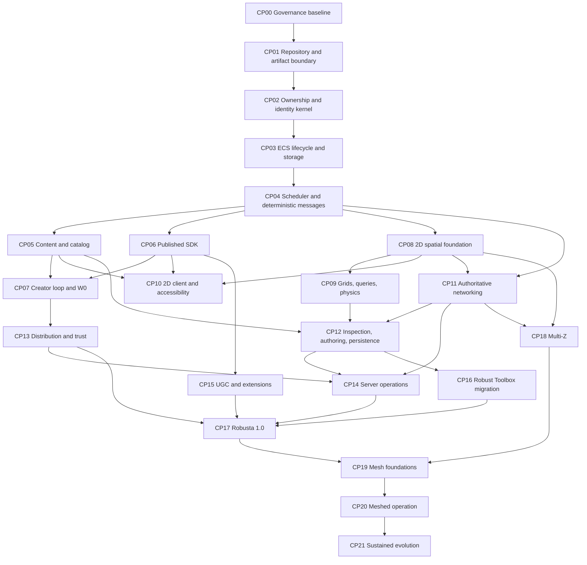

# Robusta Complete Platform Development Roadmap

- **Status:** Proposed living master roadmap
- **Baseline date:** 2026-07-21; decision review updated 2026-07-26
- **Planning horizon:** Groundwork through Robusta 1.0, Multi-Z, server-meshed operation, and sustained evolution
- **Authority:** Lower than the platform constitution and accepted ADRs
- **Companion:** [`development-plan.md`](development-plan.md) remains the detailed first-release plan
- **Decision program:** [`adr-development-program.md`](adr-development-program.md) normalizes the 99 source questions into dependency-ordered ADR and specification packages
- **Current implementation position:** CP02 groundwork is in progress; ADRs 0044-0051 are accepted via Option A and their decision-specific bounded implementations remain not started; the CP02 cleanup/fault and CP01 core/Preview compatibility profiles are the next parallel reviews; accepted CP03 design supplies no gameplay capability or evidence

## Purpose

This is the checkpoint spine for developing Robusta as a complete engine and game platform. It continuously answers:

1. What user outcome are we making real?
2. Which accepted decisions authorize the next implementation slice?
3. What code, tools, diagnostics, documentation, packaging, and operational work belong to it?
4. What evidence closes the checkpoint rather than merely showing that code exists?
5. Which unanswered questions require another ADR before public, durable, wire, or operational contracts freeze?

Robusta treats creator experience, player experience, server operation, migration, compatibility, and diagnosis as engine work. An ECS or renderer without its supported journey is groundwork, not a completed platform capability.

This roadmap cannot silently change an accepted decision. A material disagreement stops at the decision boundary and produces an ADR that amends or supersedes the old decision.

## Product direction

Robusta is a primarily 2D, server-authoritative engine and complete game platform designed around development and player experience as first-class concerns.

The intended platform provides:

- an ergonomic published Game SDK for independent teams;
- a high-integrity ECS and deterministic simulation model for large, long-lived multiplayer games;
- multiple isolated worlds within one trusted game-host process;
- layered 2D space, called **Multi-Z** here, without requiring 3D rendering or untyped raw coordinates;
- server meshing across multiple nodes without collapsing node, host, world, region, session, network, or durable identity;
- strong 2D client, spatial, content, networking, persistence, tooling, packaging, and operations foundations;
- a lessons-learned successor path for Robust Toolbox games rather than binary compatibility or an engine clone;
- credible paths for station-like games such as Space Station 14 and RMC 14, continuously checked against unrelated games; and
- a designed player journey for installation, connection, update, recovery, compatibility failure, and diagnosis.

“Supports games like” does not currently promise complete parity, source compatibility, binary compatibility, or effortless migration. It means representative mechanics, scale, content, multiplayer, operations, and workflows must be possible through supported contracts with progressively reduced migration pain. A stronger promise requires an ADR and quantitative evidence profile.

## Reconciliation with accepted decisions

| Vision statement | Relationship | Roadmap treatment |
|---|---|---|
| Development experience first | Aligned with the constitution and ADRs 0001-0003 and 0009 | Every checkpoint includes workflow, diagnostics, documentation, and external-consumer evidence |
| Player experience first | Aligned in principle but under-specified mechanically | Add product decisions for install, update, connection, recovery, accessibility, and failure UX |
| Multiple worlds per server | Aligned with ADRs 0011, 0012, 0017, and 0028 | Complete isolation, fairness, disposal, catalog leasing, and diagnosis before scaling outward |
| Primarily 2D | Aligned with ADR 0014 and ADRs 0030-0033 | Keep 3D outside the platform floor and backend types outside the SDK |
| Multi-Z | Compatible with 2D if it is typed layered space; not yet an accepted contract | Product ADR must define layers, adjacency, perception, traversal, physics, interest, authoring, saves, and release scope |
| Server meshing | A new long-horizon promise beyond the accepted single-host model | Product and technical ADR families must define authority, routing, handoff, consistency, failure, and operations |
| Immensely robust ECS | Aligned directionally with ADRs 0013, 0015, 0019, 0020, 0029, 0042, and 0043 | Translate “robust” into atomicity, stale safety, determinism, isolation, scale, inspection, and migration evidence |
| Few pain points for SS14/RMC-like games | Stronger than the current assisted-migration/no-parity promise | Establish a feature census, migration pain budget, and an ADR if parity or coverage becomes promised |

## Terms

- **Platform:** SDK, runtimes, compiler, tools, packaging, installation, diagnostics, testing, migration, and operations.
- **Engine:** Simulation, ECS, spatial, client, networking, content, and runtime foundations inside the platform.
- **Game host:** One process incarnation loading one exact executable game installation.
- **World:** One isolated authoritative simulation with its own entities, time, maps, random state, physics, and work.
- **Runtime map:** A world-local instantiation of an immutable map definition.
- **Z layer:** A typed layered-2D spatial domain. It is not a raw numeric coordinate, magic map offset, server node, or automatically a runtime map.
- **Mesh node:** One process or service instance in a declared server-mesh topology.
- **Authority region:** A bounded simulation responsibility owned by one mesh node for one committed epoch.
- **Server meshing:** Coordinated authoritative operation across nodes. Several independent worlds in one process are not server meshing.
- **Roadmap checkpoint:** A gate closed by decisions, implementation, and evidence; not a saved-world checkpoint.

## Checkpoint operating model

### States

- **Not started** — implementation has not begun.
- **Decision work** — required ADRs are under review.
- **In progress** — authorized implementation is underway.
- **Evidence ready** — the complete packet awaits review.
- **Complete** — exit criteria and evidence were accepted.
- **Blocked** — a named decision or external dependency prevents progress.
- **Superseded** — a later roadmap revision replaced the checkpoint while preserving history.

### Closure rule

A checkpoint closes only when all applicable items exist:

1. accepted product and technical decisions;
2. implementation through supported boundaries;
3. positive, negative, fault, cleanup, and resource-bound tests;
4. diagnostics and inspection;
5. creator/operator documentation;
6. compatibility, migration, and deprecation classification;
7. package, side, trust, and exact-receipt treatment;
8. representative performance evidence;
9. external-game evidence for game-facing capability; and
10. an updated capability register and evidence ledger with honest labels.

### Evidence packet

Every checkpoint records its ID, revision, owner, reviewers, decisions, exact commit, toolchain, OS/architecture, runtime receipt, package lock, workload versions, raw test and performance output, diagnostics, security and failure evidence, external-consumer receipts, limitations, support labels, and closure review.

### Change control

- A roadmap may reorder authorized work or expose omissions.
- It cannot narrow, expand, or reinterpret an accepted promise.
- New public APIs, protocols, durable formats, package contracts, trust boundaries, or cross-node guarantees require technical ADRs.
- User-visible changes to scope, authority, persistence, compatibility, safety, or release obligations require product ADRs.
- Disposable spikes cannot become the sole basis of a public contract.

## Dependency overview

The graph expresses evidence dependencies, not a ban on parallel research, fixtures, or disposable bakeoffs.

## Current position

| Checkpoint | State | Evidence or blocker |
|---|---|---|
| CP00 | Complete | Existing M0 scope/evidence baseline and constitution |
| CP01 | In progress | Build scaffold, CI, artifact feed, and boundaries exist; the core/Preview compatibility profile remains unreviewed |
| CP02 | In progress | Ownership scopes, catalog leases, opaque ephemeral identities, cleanup, and focused tests exist |
| CP03 | Not started | ADRs 0048-0051 are accepted via Option A, but no CP03 mechanism or evidence exists and production work waits for the CP02 predecessor/evidence boundary plus retained gates |
| CP04-CP21 | Not started | No capability claim; many have accepted direction but incomplete mechanisms |

## Cross-cutting requirements

### Creator experience

- Ordinary work uses published SDK contracts, generated declarations, readable content, stable diagnostics, and one command path.
- Generated failures point to authored source.
- Rejected work explains scope, side, authority, lifecycle, compatibility, and remediation.
- Changes are classified as reload, rebuild, restart, reconnect, migrate, reject, or ignore.
- Templates use the same package path as external games.

### Player experience

- Installation and launch use exact verified releases.
- Compatibility fails before partial connection or corrupt state and gives an actionable reason.
- Updates are interruption-safe and rollback is explicit.
- Readiness, queueing, reconnect, correction, and disconnection are honest.
- Input, UI, text, audio, scaling, and accessibility have a support floor.

### Operator experience

- Configuration, secrets, admin, health, logs, metrics, traces, drain, backup, restore, and crash recovery are product contracts.
- Every scope and later mesh region is attributable without using identity as authority.
- Overload and degradation are visible rather than hidden by changed gameplay time.

### Determinism and concurrency

- Fixed-step gameplay has one serial semantic oracle.
- Parallel execution uses the same access, ordering, buffers, reducers, faults, and merge path.
- Completion order, worker identity, hash enumeration, wall time, locale, and untracked I/O never order gameplay.
- Every determinism claim names its domain.

### Compatibility, identity, and trust

- Runtime, network, durable, document, catalog, package, receipt, host, session, world, map, frame, operation, and mesh identities remain nominal and scoped.
- Mapping establishes purpose-bound correlation, never equality, ownership, trust, or permission.
- Compatibility is evaluated per operation across named dimensions.
- Trusted games, operator extensions, and public UGC remain distinct; signatures prove identity/integrity, not safety.
- Untrusted inputs are bounded before allocation, decoding, lookup, expansion, or execution.

### Optional capability cost

An unadmitted capability starts no service, thread, native adapter, or periodic work; adds no per-entity state; and forces no side-specific payload. Minimal headless, non-spatial, and contrasting profiles receive measured budgets.

## Checkpoint plan

### CP00 — Governance, scope, and evidence baseline

**State:** Complete through M0.

**Objective:** Make scope, decision authority, support labels, evidence, and external validation auditable before engine work expands.

**Exit:** Constitution, quality bar, ADR process, first-release scope, evidence ledger, reference-game rule, metrics structure, and migration census exist; no scaffold is described as demonstrated capability.

### CP01 — Repository, build, dependency, and artifact boundary

**State:** In progress.

**Objective:** Establish a reproducible package topology without making every logical folder an assembly or letting external games depend on internals.

**Decision gates:** Reviewed/approved core/Preview SDK compatibility and analyzer/generator-admission profile; analyzer/generator packaging; reproducible build/source-link; dependency, vulnerability, and license policy. Deprecation and support-window promises wait for `PRD-EVOLUTION`.

**Deliverables:** Minimal justified assemblies; logical source folders; central build policy; Windows/Linux CI; versioned feed; external consumer; deterministic pack; API/package/side/dependency/license audits; contributor guidance.

**Exit:** A clean external project restores published artifacts on supported systems and cannot reference runtime internals or opposite-side material.

### CP02 — Ownership and ephemeral identity kernel

**State:** In progress.

**Objective:** Make host, world, session, attachment, catalog lease, lifetime, cleanup, and incarnation identity executable before gameplay state exists.

**Decision gates:** Generated identities/codecs; scope activation; capture validation; diagnostic formatting/redaction; reviewed/approved CP02 cleanup/fault profile before production close-path replacement or expanded reversal semantics.

**Deliverables:** Sibling world/session scopes; explicit attachments; catalog leases; admission closure; attachment-first teardown; reverse cleanup; aggregated faults; idempotent concurrent close; nominal internal identities; capture rules; leak/budget diagnostics.

**Exit:** Two-world/two-session permutations pass; leases cannot collect early; invalid capture/admission fails; no resource survives host shutdown.

### CP03 — ECS lifecycle, storage, and queries

**State:** Not started.

**Objective:** Deliver a high-integrity world-local ECS without making every datum an entity or freezing storage layout into the SDK.

**Decision gates:** ADRs 0048-0051 are accepted independently via Option A for component and world-resource schemas; private storage families; canonical query order; borrow lifetime; change tracking; allocation and fragmentation; and structural planning, conflict, reversal, agreement, and publication. Their design gate is satisfied, while production implementation still waits for the CP02 predecessor/evidence boundary and retained identity, activation, fault, compatibility, specification, SDK, and budget gates.

**Deliverables:** Generational `EntityRef`; atomic `Preparing/Live/Ending/Ended`; staged birth/change/death; explicit resolution APIs; private dense/sparse-or-packed/tag/resource storage; generated schemas and phase-scoped queries; canonical iteration and scheduler-issued partitions; prepared structural plans with one publication point; stale/wrong-world/exhaustion handling; lifecycle inspection; churn and memory benchmarks.

**Exit:** Atomic lifecycle, structural-publication, and stale-reference suites pass under injected failure; storage reuse never aliases; canonical query results are layout-independent; minimal entities and world resources work; public contracts remain storage-agnostic.

### CP04 — Fixed-step scheduler, typed messages, and deterministic effects

**State:** Not started.

**Objective:** Give authoritative gameplay one meaning across serial and supported parallel execution.

**Decision gates:** Access keys; partitions; reducers; event budgets; overload/fairness; timer/random algorithms; affinity; reviewed/approved world-fault profile.

**Deliverables:** Integer clock, manual driver, pause, timers, random streams; stable system graph; separate requests/commands/events/notifications; deterministic waves and commit frontier; immutable results/records; generated phase leases; effect buffers; serial oracle; affinity lanes; bounded overload; randomized interleaving and fault tests.

**Exit:** Identical inputs yield identical committed traces across oracle and worker configurations; overload is visible and bounded; failed batches expose no buffered output.

### CP05 — Content compiler, catalog, and provenance

**State:** Not started.

**Objective:** Turn readable content into exact immutable runtime inputs with source-quality diagnostics.

**Decision gates:** Identifier grammar; schema language; composition/patches; resource/localization identity; canonical encoding/digest; incremental build; adoption.

**Deliverables:** Workspace/package lock; source-located IR; package-qualified definitions; deterministic composition and validation; assets/localization/maps; immutable generation and provenance; resolved inspection; clean-equivalent incremental cache; bounded public content; compatibility classification.

**Exit:** Clean and incremental builds are byte-identical; ambiguity fails before launch; every resolved value is inspectable to source.

### CP06 — Published Game SDK, generators, analyzers, and templates

**State:** Not started.

**Objective:** Keep ordinary authoring concise while enforcing side, authority, lifetime, identity, scheduling, trust, and compatibility.

**Decision gates:** Preview compatibility; manifest schemas; analyzer severity; advanced ABI; package/version policy.

**Deliverables:** Common/shared/client/server packages; generated components, systems, queries, messages, content, synchronization and capabilities; no manual ordinary registration; analyzers for leakage/internals/service location/escaped phase data/undeclared effects/raw identities/UGC; docs, templates, API diffs, external games.

**Exit:** External games implement native mechanics without internal access; generation is reproducible; invalid use reports authored source; client artifacts contain no server material.

### CP07 — Creator loop and published W0 walking skeleton

**State:** Not started.

**Objective:** Prove the shortest complete journey from installed tools to local 2D interaction through a separate authority.

**Decision gates:** Workspace manifest; CLI; protected rendezvous; local credentials; process ownership; change classification; readiness; reviewed/approved launch compatibility and creator-supervisor fault profiles.

**Deliverables:** Installable CLI/template; restore/build/compile/project/launch/log/cleanup; separate client/authority; exact receipt/catalog; authenticated minimal handshake; one generated input/state path; structured diagnostics; explicit edit behavior; clean Windows/Linux W0 runs.

**Exit:** A new developer installs, creates, runs, interacts, diagnoses an injected error, and leaves no orphan process using published artifacts only.

### CP08 — 2D maps, frames, transforms, and typed relations

**State:** Not started.

**Objective:** Provide explicit stale-safe 2D spatial meaning across multiple maps and moving frames without mandatory transforms.

**Decision gates:** Numerical units; map/frame generations; transform graph; relation schemas; map lifecycle; portals; preliminary Multi-Z product contract.

**Deliverables:** Runtime maps distinct from sources/definitions; frame-qualified quantities; optional transforms; canonical transform updates; separate spatial, containment, attachment, lifecycle, and reference relations; atomic map/frame/relation publication and ending; spatial provenance in network/save/inspection; types that do not preclude Multi-Z or mesh partitioning.

**Exit:** Duplicate map instances remain distinct, stale frames never alias, relocation and relations commit atomically, ending is explicit, and non-spatial worlds omit spatial cost.

### CP09 — Compact grids, spatial queries, collision, and physics

**State:** Not started.

**Objective:** Supply station-capable but genre-neutral spatial mechanics for both reference games.

**Decision gates:** Cell/chunk representation; topology; construction; dynamic split/merge horizon; query structures; collision layers; physics backend/order/determinism; native task integration.

**Deliverables:** Optional compact grids and anchoring; bounds/ray/overlap/nearest/visibility queries; collider rebuild at commit boundaries; world-owned authoritative physics; stable contact/event buffers; native lifetime/affinity/fault/payload treatment; dense and sparse workloads; optional capability cost measurements.

**Exit:** W1/W2 outcomes are stable, non-spatial profiles omit payload/work, disposal is clean, and no backend type enters the SDK.

### CP10 — 2D client, input, UI, audio, localization, and accessibility

**State:** Not started.

**Objective:** Deliver a responsive, accessible, recoverable 2D desktop client separated from authoritative simulation.

**Decision gates:** Platform backend/thread; graphics; render graph; resources/shaders; text/font fallback; UI semantics/accessibility; input/rebinding; audio; device loss; reviewed/approved client/device fault profiles.

**Deliverables:** SDK-owned presentation descriptions; explicit native ownership; cameras, sprites, animation, lighting, particles, text and clipping; action input, controllers, text/IME and focus; game UI with layout, navigation, localization, scaling and accessibility bridge; audio buses/voices/streaming/devices; confirmed/predicted snapshots; DPI, monitor, hot-plug, background and device-loss behavior; dense/sparse client workloads.

**Exit:** Client behavior is tick-independent, device failure cannot corrupt worlds, accessibility is tested, and exact native payloads are auditable.

### CP11 — Authoritative networking, interest, prediction, and reconnect

**State:** Not started.

**Objective:** Make secure routine multiplayer a platform capability rather than bespoke game plumbing.

**Decision gates:** Transport/crypto; authentication; reviewed/approved handshake compatibility profile; schema evolution; interest/secrecy; snapshot/delta; prediction/correction; bandwidth/overload; reconnect.

**Deliverables:** Protected rendezvous and compatibility vector; attachment-local network IDs/tombstones; generated bounded schemas; owner/observer authorization, interest, containment secrecy and PVS; baselines/deltas/acks/resync; prediction and side-effect reconciliation; rate/congestion/backpressure/disconnect policy; fresh reconnect mappings; protocol fuzz and network-fault matrices.

**Exit:** One authority and two clients complete the station-like fault matrix with bounded correction, no secret leakage, clean reconnect, and unchanged authoritative results.

### CP12 — Inspection, testing, authoring, persistence, adoption, and replay

**State:** Product direction is settled by accepted ADRs 0039-0041; technical ADR, schema, profile, and evidence work remains open.

**Objective:** Make worlds understandable, testable, authorable, recoverable, and reproducible through supported boundaries.

**Decision gates:** Checkpoint envelope/repository, durable IDs, migration, adoption transaction, and map documents proceed under accepted ADRs 0035-0038 with reviewed/approved restore, catalog-adoption, and map-preview compatibility profiles. Accepted ADR 0039 requires `OBS-INSPECTION` plus a reviewed inspection compatibility profile before cross-version, public, or remote admission. Accepted ADR 0040 requires `TEST-RUNTIME`, a reviewed test-execution or ordinary world-construction compatibility profile, and the earlier CP02 ownership and CP04 world-fault profiles. Accepted ADR 0041 requires `REPLAY-AUTHORITATIVE` plus reviewed replay-reexecution compatibility and replay-owner fault profiles before replay-world publication. Product acceptance does not select those mechanisms or profiles.

**Deliverables:** Authorized owner-scoped committed inspection; isolated production-semantic tests through ordinary activation; manual stepping/fault injection; canonical map documents/revisions/collaboration/preview; atomic versioned checkpoints and unpublished restore; durable and checkpoint-local references; forward migration; fenced catalog adoption; replay-local records and fresh runtime identities; replay only within its accepted compatibility/determinism scope; tools that preserve identity and authority distinctions.

**Exit:** W3/W4 pass faults, map edits round-trip, inspection grants no authority, tests use production semantics, and replay claims match their accepted domain.

### CP13 — Packaging, installation, update, rollback, and trust

**State:** Not started.

**Objective:** Turn games into exact side-specific applications with interruption-safe lifecycle and honest trust.

**Decision gates:** Manifest/receipt; publisher trust roots; signing/revocation/rotation; downgrade defense; registry; install layout/GC; writable data; native projection; player UX; reviewed/approved install compatibility profile.

**Deliverables:** Deterministic side projections; exact receipts across runtime/SDK/packages/catalog/network/save/extensions/licenses; explicit verification; immutable content-addressed installation and leases; atomic activation and collection; side-by-side releases; executable rollback distinct from data migration; launcher process separation; side/dependency/license/process audits; player install/update/recovery experience.

**Exit:** Clean machines install exact external releases, survive interruption, reject tampering/downgrade by policy, roll back executable state, and preserve data according to declared outcomes.

### CP14 — Dedicated-server configuration, administration, and recovery

**State:** Not started.

**Objective:** Make operating trusted game hosts a supported product journey.

**Decision gates:** Config/secrets; admin authorization; health/readiness; drain; crash/restart; backup; quotas/fairness; observability schemas; privacy/retention; reviewed/approved operations fault profile.

**Deliverables:** Validated layered configuration and secrets; gameplay-separated administration; logs/metrics/traces/audit/health/readiness; scope and backlog/resource attribution; graceful drain/shutdown; crash bundles/redaction/restart loop prevention; backup/restore/update orchestration; process and container deployment guides.

**Exit:** Operators deploy, configure, observe, drain, back up, restore, update, roll back, and diagnose from release artifacts without engine source.

### CP15 — Public UGC and advanced extensions

**State:** Not started.

**Objective:** Support safe public creation and powerful trusted integration without confusing their guarantees.

**Decision gates:** Declarative language; validation/resource budgets; grants; extension ABI/manifest; native isolation; nonconforming disclosure; graduation; reviewed/approved extension-admission compatibility and native-extension fault profiles.

**Deliverables:** Public data/assets and finite game-declared operations; deterministic limits; no public filesystem/network/process/native/reflection/arbitrary assembly powers; denial tests; versioned trusted adapters with side/trust/capability/affinity/determinism/fault/package/compatibility declarations; support downgrades for nonconformance; equal paths for official and independent packages.

**Exit:** Public add-ons fail closed under attacks while an external game ships an unusual trusted adapter without private access or privileged treatment.

### CP16 — Assisted Robust Toolbox migration

**State:** Not started.

**Objective:** Reduce the real cost of moving representative Robust Toolbox games without freezing Robusta around legacy internals.

**Decision gates:** Pinned baselines; coverage profile; thresholds; compatibility package and retirement; rewrite/manual boundaries.

**Deliverables:** Immutable RT/SS14/RMC-relevant baselines and census; source-located migration IR; importers/analyzers/fixes/content/map/UI converters; exact outcome classifications; compatibility above the public SDK; task-based guidance; measured time, coverage, warning accuracy, manual and unsupported rates.

**Exit:** A bounded station slice migrates with an auditable report, blocked cases remain visible, and the result uses published artifacts without an engine fork.

### CP17 — Robusta 1.0 qualification

**State:** Not started.

**Objective:** Qualify the complete ADR 0014 journey rather than promote a walking skeleton by schedule.

**Decision gates:** All accepted 1.0 requirements; numeric budgets; environments; external owners; `PRD-EVOLUTION`; reviewed/approved Supported SDK compatibility and deprecation profile.

**Deliverables:** Two separately maintained games; station-like and contrasting slices; clean Windows/Ubuntu/container journeys; complete docs; compatibility/update/rollback/corruption/security/outage/device/network/load exercises; numeric creator/runtime/client/network/package/migration/recovery budgets; honest capability ledger; release/support/incident policy.

**Exit:** Every constitution proof and ADR 0014 journey passes from exact artifacts with raw evidence and independent confirmation.

### CP18 — Multi-Z qualification

**State:** Not started; product ADR required.

**Objective:** Support large layered 2D worlds with explicit vertical relationships while preserving typed space, authority, interest, persistence, and authoring.

**Decision gates:** Multi-Z product promise; layer identity/ownership; layer/map distinction; adjacency/traversal; occlusion/audio/projectiles; physics; interest; authoring; save/network/replay; support level and 1.0 relationship.

**Deliverables:** Nominal Z-layer identity; explicit above/below/connected/portal/elevator/shaft/stair relations; bounded conversion/traversal; per-layer and cross-layer queries, collision, perception, lighting, audio, interest and secrecy; layered editor/inspector; persistence/network/catalog treatment; selected moving/static structures; station and contrasting fixtures; numeric layer/edge/query/network/edit/save budgets.

**Exit:** Equal local coordinates on layers never cross-resolve, interactions use declared relationships, ending is atomic, and clients receive only authorized cross-layer state.

### CP19 — Server-mesh topology, authority, identity, and routing

**State:** Not started; product and technical ADR family required.

**Objective:** Define a server mesh without weakening single-host correctness or pretending distributed failure is an in-process scope.

**Decision gates:** Product promise; topology/control plane; regions/partitions; consistency; epochs; routing/membership; trust/compatibility; clock assumptions; failures; deployment; reviewed/approved mesh compatibility and fault profiles.

**Deliverables:** Separate mesh/node/host/world/region/route/handoff identities; purpose mappings; epoch-fenced ownership; node admission/health/topology/routes; explicit independent-world versus distributed-world modes; single accepted authority per region/epoch; client routing; exact receipt/catalog/schema admission; no wall-clock gameplay order; multi-process fault testbed.

**Exit:** Duplicate authority is fenced, stale routes fail closed, incompatible nodes cannot join, and node loss has bounded documented effects.

### CP20 — Meshed-world handoff, load, recovery, and operations

**State:** Not started.

**Objective:** Operate supported gameplay across nodes under movement, load, maintenance, and faults.

**Decision gates:** Export/import; handoff; client continuity; cross-region interaction; distributed persistence; backpressure; placement; recovery; degraded mode; split-brain; administration.

**Deliverables:** Prepared versioned handoff with source fencing/target publication; fresh reconstruction mappings; client route transition; declared cross-region ordering/latency/idempotency/failure; placement/drain/rebalance/hot-region policy; crash/partition/slow/incompatible/control/storage behavior; mesh observability and audit; rolling update/rollback; only the accepted checkpoint consistency guarantee.

**Exit:** Regions move without double activation, clients recover within budget, partitions cannot create two accepted authorities, and operators can explain every active region and route.

### CP21 — Sustained platform evolution

**State:** Not started.

**Objective:** Keep Robusta usable as SDKs, formats, platforms, games, extensions, and mesh deployments evolve.

**Decision gates:** Support windows; release train; long-term migration; extension lifecycle; vulnerability response; telemetry governance; new platform admission.

**Deliverables:** Automated API/schema/receipt comparison; deprecation/migration/removal; long-term save/document/package/server fixtures; incident/security/revocation/recovery process; external feedback ownership; recurring game/performance/accessibility/operations qualification; support-label graduation; roadmap/ADR/evidence audits.

**Exit:** A supported platform and game upgrade crosses a meaningful compatibility boundary through published migration and rollback paths without an engine fork.

## Capability completion matrix

| Family | First usable | Complete-platform evidence | Expansion |
|---|---|---|---|
| Ownership/isolation | CP02 | CP17 | CP19-CP20 mesh scopes |
| ECS/lifecycle | CP03 | CP17 | CP18 layered and CP20 distributed workloads |
| Scheduling/messages | CP04 | CP17 | CP20 cross-region ordering |
| Content/catalogs | CP05 | CP17 | CP18 layered sources; CP20 deployment |
| Game SDK | CP06 | CP17 | CP21 evolution |
| Creator workflow | CP07 | CP17 | CP18/CP20 tools |
| 2D space | CP08 | CP17 | CP18 Multi-Z |
| Grids/physics | CP09 | CP17 | CP18 cross-layer mechanics |
| Client | CP10 | CP17 | CP18 layered perception |
| Multiplayer | CP11 | CP17 | CP19-CP20 meshing |
| Inspection/persistence | CP12 | CP17 subject to accepted scope | CP18/CP20 evidence |
| Delivery/trust | CP13 | CP17 | CP20 rolling deployment |
| Operations | CP14 | CP17 | CP19-CP20 mesh operation |
| UGC/extensions | CP15 | CP17 | CP21 lifecycle |
| Migration | CP16 | CP17 | CP18 station coverage |
| Multi-Z | CP18 | CP18 | CP20 if distributed layering is selected |
| Server meshing | CP19 | CP20 | CP21 sustained operation |

## Proposed workloads beyond W0-W4

These are roadmap fixtures, not accepted budgets or promises.

| Workload | Shape | Evidence |
|---|---|---|
| W5 Layered station | Six layers, two maps, declared vertical links, 5,000 entities, containment, cross-layer perception/projectiles | Layer identity, traversal, interest/secrecy, physics/query cost, editor, save/network fidelity |
| W6 Layered contrast | Short-round replacement layers, no grids/inventory, portals and spectators | Anti-station coupling, lifecycle, optional cost, reconnect/observation |
| W7 Mesh placement | Eight worlds on three nodes with one hot world | Placement, fairness, routing, drain, compatibility, isolation |
| W8 Region handoff | One world, four authority regions, moving population | Fencing, mappings, continuity, latency, duplicate-authority denial |
| W9 Mesh faults | Crash, partition, delay, duplicate, control loss, incompatibility, storage outage | Split-brain prevention, recovery, degraded behavior, diagnosis |
| W10 Station migration | Pinned ECS/content/map/grid/physics/network/UI/tools/ops slices | Coverage, warning accuracy, manual work, unsupported cases, time/pain |

Each workload needs versioned inputs, exact receipt, environment metadata, raw results, and a non-representativeness warning. Calibration sizes are not budgets without review.

## Source ADR question inventory

These 99 questions are the source inventory, not 99 required ADR files and not accepted decisions. Queue IDs are local and reserve no ADR numbers. The normalized [`ADR development program`](adr-development-program.md) consolidates them into 65 ADR candidates and five specification-first packages, preserves every source ID exactly once, and defines the dependency and checkpoint gates. That program is the actionable planning view; this section remains the traceable source.

### Product decisions

| ID | Question | Gate |
|---|---|---|
| P-PLAYER-01 | What install, update, connection, compatibility-failure, recovery, and crash UX is promised? | CP10-CP14 |
| P-ACCESS-01 | What accessibility floor covers client, input, UI, audio, and creator tools? | CP10 |
| P-MULTIZ-01 | What does Multi-Z mean and which behaviors belong to the platform? | CP08/CP18 |
| P-MULTIZ-02 | Does any Multi-Z subset amend Robusta 1.0 or remain post-1.0? | CP08/CP17 |
| P-MESH-01 | What server-meshing outcome is promised to games, players, and operators? | CP19 |
| P-MESH-02 | Which consistency, availability, handoff, and recovery guarantees are deliberately excluded? | CP19 |
| P-MIGRATE-01 | What quantitative migration profile and station-game pain budget gate release? | CP16 |
| P-PARITY-01 | Is station-game support representative capability or a named parity target? | CP16/CP17 |
| P-OPS-01 | What server recovery, backup, drain, and support outcome is required? | CP14 |
| P-EVOLVE-01 | What stable SDK/format support window begins at 1.0? | CP17/CP21 |

### Foundation, identity, compatibility, and lifecycle

| ID | Question | Gate |
|---|---|---|
| F-ID-01 | What schema generates identity kinds, scopes, encoding permissions, redaction, and codecs? | CP02 |
| F-ID-02 | How do incarnation, generation, exhaustion, collision, reuse, and tombstones work by kind? | CP02/CP03 |
| F-MAP-01 | What purpose-bound mapping and retention contract joins identity kinds? | CP11/CP12 |
| F-COMPAT-01 | What compatibility-vector schema and result vocabulary are canonical? | CP01/CP13 |
| F-COMPAT-02 | How does one rules engine evaluate install, launch, handshake, restore, adoption, preview, extension admission, and mesh join? | CP07/CP11/CP12/CP13/CP15/CP19 |
| F-SCOPE-01 | What generated activation metadata and capability graph replace manual composition? | CP02/CP06 |
| F-SCOPE-02 | What analyzer/runtime rules reject invalid lifetime capture and ambient mutable state? | CP02 |
| F-CLEAN-01 | What cleanup budgets, leak policy, escalation, and reports apply to each scope? | CP02/CP14 |
| F-FAULT-01 | What world, host, client, tool, native-extension, and mesh fault states and transitions exist? | CP04/CP07/CP10/CP14/CP15/CP19 |
| F-BUDGET-01 | How are CPU, memory, queue, I/O, native, and output budgets declared and enforced? | CP04/CP15 |

### ECS, scheduling, and messages

| ID | Question | Gate |
|---|---|---|
| E-COMP-01 | What makes a component schema stable, side-qualified, generated, and compatible? | CP03 |
| E-STORE-01 | Which storage families exist and what remains private? | CP03 |
| E-QUERY-01 | What query order, snapshot, borrow, change filter, partition, and invalidation semantics apply? | CP03/CP04 |
| E-RESOURCE-01 | Which world resources are ECS-adjacent but not entities/components? | CP03 |
| E-STRUCT-01 | What planner, conflict policy, inverse, result retention, and commit record implement ADR 0042? | CP03/CP04 |
| E-SYSTEM-01 | How are systems identified, activated, ordered, configured, inspected, and migrated? | CP04/CP06 |
| E-ACCESS-01 | What generated access keys and partitions prove scheduler independence? | CP04 |
| E-EVENT-01 | What schema, cardinality, reducer, wave, fan-out, and budget rules govern messages? | CP04 |
| E-TIME-01 | What duration, timer, pause, catch-up, overload, admission, and fairness policy applies? | CP04 |
| E-RANDOM-01 | What random-stream algorithm and compatibility domain are receipt material? | CP04/CP12 |
| E-REDUCE-01 | What deterministic reducer registry and numerical policy are supported? | CP04 |
| E-AFFINITY-01 | What worker, scheduler, platform, render, audio, and native lanes exist? | CP04/CP10 |

### Content, SDK, and creator workflow

| ID | Question | Gate |
|---|---|---|
| C-ID-01 | What package/definition/resource/localization grammar and normalization are canonical? | CP05 |
| C-COMPOSE-01 | What inheritance, composition, patch, conflict, and override semantics apply? | CP05 |
| C-CANON-01 | What catalog encoding, semantic digest, and provenance envelope are exact? | CP05 |
| C-INCR-01 | What cache keys/invalidation preserve clean-build identity? | CP05 |
| C-ASSET-01 | How are assets imported, transformed, identified, projected, streamed, and licensed? | CP05/CP10 |
| SDK-GEN-01 | What declaration manifest joins code, messages, content, network, saves, and receipts? | CP06 |
| SDK-COMPAT-01 | What core/Preview compatibility and analyzer/generator admission apply at CP01, and what Preview/Supported deprecation and support windows apply after `PRD-EVOLUTION`? | CP01/CP17 |
| SDK-TEMPLATE-01 | What templates, samples, test packages, and upgrades are supported? | CP06/CP07 |
| TOOL-CLI-01 | What workspace and command contract defines the creator front door? | CP07 |
| TOOL-SUP-01 | What supervision, readiness, cancellation, cleanup, and diagnostic-stream contract applies? | CP07 |
| TOOL-EDIT-01 | How are edits classified as reload/rebuild/restart/reconnect/migrate/reject/ignore? | CP07/CP12 |

### Spatial, Multi-Z, physics, and client

| ID | Question | Gate |
|---|---|---|
| S-UNITS-01 | What units, precision, overflow, tolerance, and numerical compatibility apply? | CP08 |
| S-MAP-01 | What map/frame storage, generation, conversion, lifecycle, and stale-reference mechanism is used? | CP08 |
| S-XFORM-01 | What transform graph, dirty propagation, update, interpolation, and cycle policy applies? | CP08 |
| S-REL-01 | What schemas implement spatial, containment, attachment, ownership, and references? | CP08 |
| S-GRID-01 | What cell/chunk representation, construction mutation, and anchoring are supported? | CP09 |
| S-TOPO-01 | Are dynamic split/merge and attachment reassignment supported and under what budgets? | CP09 or later |
| S-QUERY-01 | What query API, canonical ordering, partition, and allocation contract is public? | CP09 |
| S-PHYS-01 | Which physics adapter and ordering/fault/determinism contract is selected? | CP09 |
| S-MULTIZ-01 | Are layers maps, frames, a separate domain, or composition; what substitutions are forbidden? | CP18 |
| S-MULTIZ-02 | What adjacency, traversal, occlusion, physics, interest, and lifecycle semantics apply? | CP18 |
| S-PORTAL-01 | What cross-map/layer observation and transfer mechanics are supported? | CP18 |
| CL-PLATFORM-01 | Which client stack and thread ownership model pass the bakeoff? | CP10 |
| CL-RENDER-01 | What render/resource/shader/camera/sprite/light/text/device-loss contract is public? | CP10 |
| CL-INPUT-01 | What action/device/rebinding/text/focus/prediction-input contract applies? | CP10 |
| CL-UI-01 | What UI layout/style/semantics/accessibility/localization/entity-binding contract applies? | CP10 |
| CL-AUDIO-01 | What audio graph/stream/device/spatialization/affinity/accessibility contract applies? | CP10 |

### Networking and server mesh

| ID | Question | Gate |
|---|---|---|
| N-TRANS-01 | Which transport, crypto, auth, rendezvous, discovery, and denial policies are supported? | CP07/CP11 |
| N-HANDSHAKE-01 | Which compatibility dimensions gate connection and reconnect? | CP11 |
| N-SCHEMA-01 | What generated layout, encoding, bounds, evolution, and secrecy rules apply? | CP11 |
| N-INTEREST-01 | How do space, containment, ownership, authorization, and game rules determine interest? | CP11 |
| N-SNAPSHOT-01 | What baseline/delta/ack/order/loss/tombstone/resync protocol is used? | CP11 |
| N-PREDICT-01 | What prediction/input-window/correction/side-effect/presentation contract applies? | CP11 |
| N-OVERLOAD-01 | What bandwidth/queue/rate/congestion/backpressure/disconnect policy applies? | CP11 |
| N-RECONNECT-01 | What session survival, fresh attachment, mapping, and resync behavior applies? | CP11 |
| MESH-TOPO-01 | What control-plane topology, membership, compatibility, route, and trust model applies? | CP19 |
| MESH-AUTH-01 | What region, epoch, fencing, lease, and split-brain contract applies? | CP19 |
| MESH-PART-01 | How are worlds/regions partitioned, placed, sized, and rebalanced? | CP19/CP20 |
| MESH-HANDOFF-01 | What prepare/fence/export/reconstruct/publish/retire transaction moves authority? | CP20 |
| MESH-XREGION-01 | What cross-region ordering, latency, idempotency, and failure semantics apply? | CP20 |
| MESH-CLIENT-01 | How do clients discover, route, redirect, reconnect, and preserve presentation? | CP20 |
| MESH-FAIL-01 | What happens under crash, partition, control loss, slow node, and storage outage? | CP19/CP20 |
| MESH-OPS-01 | What placement, drain, rollout, rollback, backup, topology, and admin interfaces apply? | CP20 |

### Persistence, authoring, delivery, operations, UGC, and migration

| ID | Question | Gate |
|---|---|---|
| PERSIST-ENV-01 | What checkpoint envelope, repository transaction, chunking, limits, and integrity apply? | CP12 |
| PERSIST-ID-01 | What durable domains, local records, references, collisions, and issuers apply? | CP12 |
| PERSIST-MIG-01 | What forward migration, backup, retry, failure, and operator workflow applies? | CP12 |
| CAT-ADOPT-01 | What prepare/fence/commit/reverse/client-admission transaction implements ADR 0037? | CP12 |
| DOC-MAP-01 | What map document, revision, operation, conflict, and collaboration protocol applies? | CP12 |
| INSPECT-01 | What authorization, consistency, redaction, query, protocol, and budget follows ADR 0039? | CP12 |
| TEST-01 | What supported Test SDK, manual time, fixture, and fault contract follows ADR 0040? | CP12 |
| REPLAY-01 | What artifact and compatibility domain follows ADR 0041? | CP12 |
| PKG-MANIFEST-01 | What game/package/side/capability/native/license/provenance manifest is canonical? | CP13 |
| PKG-RECEIPT-01 | What exact receipt and signature envelope is canonical? | CP13 |
| PKG-TRUST-01 | What roots/rotation/revocation/downgrade/offline/consent policy applies? | CP13 |
| PKG-INSTALL-01 | What immutable layout/lease/transaction/interruption/GC/data contract applies? | CP13 |
| OPS-CONFIG-01 | What configuration layering, validation, secrets, and provenance apply? | CP14 |
| OPS-ADMIN-01 | What admin authentication, authorization, audit, and gameplay separation apply? | CP14 |
| OPS-OBS-01 | What logs/metrics/traces/health/redaction/retention/cardinality schemas apply? | CP14 |
| OPS-RECOVER-01 | What drain/crash/restart/backup/restore/update/rollback policy applies? | CP14 |
| UGC-LANG-01 | What finite operation vocabulary and deterministic semantics are supported? | CP15 |
| UGC-BUDGET-01 | What validation/CPU/memory/nesting/expansion/output/step limits fail closed? | CP15 |
| EXT-ABI-01 | What extension manifest/ABI/capability/affinity/fault/compatibility applies? | CP15 |
| EXT-NATIVE-01 | What native loading/supply-chain/isolation/crash/exact-build policy applies? | CP09/CP10/CP15 |
| MIG-BASE-01 | Which immutable RT/SS14/RMC-relevant baselines and subsets are measured? | CP16 |
| MIG-IR-01 | What source-located migration IR and classification schema is canonical? | CP16 |
| MIG-COMPAT-01 | What temporary compatibility packages are allowed and retired? | CP16 |
| MIG-GATE-01 | What coverage/warning/manual/unsupported/time budgets gate qualification? | CP16/CP17 |

## Parallel work lanes

1. **Simulation:** CP03-CP04, then spatial and network integration.
2. **Content/SDK:** CP05-CP07, continuously checked by external consumers.
3. **Client:** CP08 research into CP10, with no backend types in the SDK.
4. **Networking:** Schema/loopback work early; full CP11 after ECS/scheduler/spatial contracts.
5. **Persistence/tooling:** Document/envelope research early; CP12 after identity/catalog/spatial stabilization.
6. **Delivery/operations:** Receipt/package/server prototypes early; qualification at CP13-CP14.
7. **Migration:** Census and fixtures immediately; automation after native contracts stabilize.
8. **Multi-Z/mesh:** Product research and workloads early; public implementation after ADR gates and prerequisites.

Every lane integrates through the same external-game, exact-receipt, diagnostics, and evidence infrastructure. Long-running isolated subsystem branches are a roadmap risk.

## Review cadence

- Review active checkpoints at least every two weeks during implementation.
- Review the ADR development program before any public, durable, wire, native, trust, or operational contract freezes.
- Run W0 and architecture boundaries continuously after CP07.
- Run W1/W2 and serial-oracle comparisons continuously after CP09/CP11.
- Run W3/W4 on persistence/catalog compatibility changes after CP12.
- Run W5/W6 on Multi-Z contract changes after CP18 begins.
- Run W7-W9 on mesh topology, handoff, compatibility, or recovery changes after CP19 begins.
- Requalify both external games before promotion to Preview or Supported.
- Audit roadmap claims against ADR implementation status and the evidence ledger before release.

## Principal risks and controls

| Risk | Control |
|---|---|
| Breadth overwhelms delivery | Thin end-to-end checkpoints, honest labels, external journeys |
| Lessons become accidental cloning | Preserve outcomes, not internals; maintain contrasting-game evidence |
| “Robust ECS” becomes marketing | Gate on atomicity, stale safety, determinism, faults, inspection, scale, ergonomics |
| Parallelism creates two meanings | One semantic path, serial oracle, generated access, deterministic effects |
| Multi-Z becomes raw integer Z | Nominal layers, explicit relationships, typed conversion, product ADR |
| Meshing starts before local correctness | CP19 depends on CP17 and fenced ownership/identity/compatibility |
| Distributed failure is called rollback | Epochs, fencing, consistency domain, checkpoint boundaries, fault ADRs |
| Station needs consume the ontology | Neutral mechanics, optional genre packages, contrasting game |
| Migration distorts native design | Native contracts first; compatibility stays above the SDK |
| Native libraries leak into SDK/server | Adapters, side audits, exact payloads, affinity/fault contracts |
| Identities collapse to strings/GUIDs | Nominal generation, bounded codecs, mappings, substitution tests |
| Player UX is delayed | Player gates in client, network, distribution, and operations checkpoints |
| Reference games become fixtures | Separate owners, published artifacts, exact receipts, no friend access |
| Budgets remain null | Version workloads and block Supported without measured budgets |
| Docs drift | Checkpoint packets, link tests, statuses, changelog, evidence audits |

## Immediate actions

1. Implement in parallel the bounded first implementation scopes authorized by accepted [ADR 0044](../decisions/technical/0044-generate-bounded-identity-declarations.md), [ADR 0045](../decisions/technical/0045-generate-typed-capability-graphs-and-closed-activation-plans.md), [ADR 0046](../decisions/technical/0046-coordinate-owner-shutdown-through-acquisition-ledgers-and-fault-profiles.md), and [ADR 0047](../decisions/technical/0047-evaluate-dimensional-compatibility-through-bounded-exact-policy-profiles.md). ADR 0045's graph/generator/factory work may begin, but replacing current identity creation waits for ADR 0044's CP02 identities; the ownership close path waits for the CP02 fault profile. For ADR 0047, first review and approve the common schema/canonical-encoding specification; repository/external-SDK behavior still waits for the CP01 profile.
2. Draft, review, and approve ADR 0046's CP02 cleanup/fault profile and ADR 0047's CP01 core/Preview compatibility profile in parallel.
3. Prepare the bounded subordinate specifications, internal conformance fixtures, reference models, and workload characterization authorized by accepted ADRs 0048 (`SIM-STATE`), 0049 (`SIM-STORAGE`), 0050 (`SIM-QUERY`), and 0051 (`SIM-COMMIT`) in dependency order; production CP03 implementation still waits for the CP02 predecessor/evidence boundary and every retained gate.
4. Follow with `FND-BUDGET`, `SIM-SYSTEM`, `SIM-MESSAGE`, and `SIM-WORLD-SERVICES` for CP04.
5. Draft and review `OBS-INSPECTION`, `TEST-RUNTIME`, and `REPLAY-AUTHORITATIVE` under accepted ADRs 0039-0041, then review their inspection, test-execution or ordinary world-construction, replay-reexecution, and replay-owner profiles; persistence, catalog adoption, and map authoring continue under accepted ADRs 0035-0038.
6. Draft `PRD-MULTIZ` before CP08 types freeze and `PRD-MESH` as a long-horizon promise without adding meshing to 1.0 by roadmap fiat.
7. Draft `PRD-PLAYER` and `PRD-ACCESS` before client, launcher, installer, and recovery contracts harden.
8. Provision named external reference-game repositories and owners.
9. Add W5-W10 specifications only after their product questions are review-ready.
10. Update the decision program and this roadmap together after every split, merge, ADR acceptance, checkpoint review, or scope change.

## Completion condition

The roadmap is not complete when every row has code. It is complete when independent teams can repeatedly create, test, package, distribute, play, operate, migrate, update, diagnose, and evolve primarily 2D games—including large station-like and contrasting games—through supported contracts, and when Multi-Z and server-meshed operation meet separately accepted guarantees under representative scale and faults.

Until then, each closed checkpoint is a trustworthy platform increment, not a claim that the whole engine is finished.
